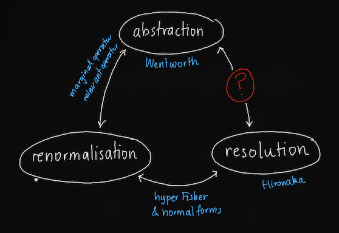

---
title:
    Abstraction seminar
description:
    Abstraction, Renormalisation, Resolution
---

# Abstraction

Renormalisation references:

* Di Francesco-Mathieu-Sénéchal "Conformal Field Theory" Ch. 3, [statistical mechanics](http://www.therisingsea.org/notes/CFT-ch3.pdf).

## Schedule

* **29-9-22** *Alexander Oldenziel* On Wentworth's Natural Abstractions
