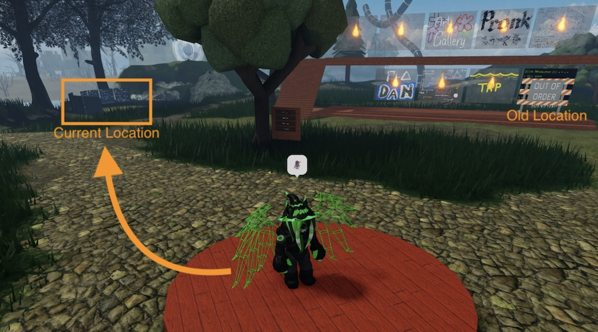

---
title:
    AI safety reading group
description:
    “For thousands of years men dreamed of pacts with demons.
    Only now are such things possible.”
---
    
<!--
`You are worse than a fool,' Michéle said, getting to her
feet, the pistol in her hand.  `You have no care for your species. 
For thousands of years men dreamed of pacts with demons. 
Only now are such things possible.  And what would you be
paid with?  What would your price be, for aiding this thing to
free itself and grow?'

---William Gibson, <i>Neuromancer</i>
-->

AI safety reading group
=======================

Weekly discussions of readings on technical and philosophical topics in
AI safety.

AI Safety is the field trying to figure out how to stop AI systems from
breaking the world, and in particular, trying to do so before they break
the world.
Readings will span from potential issues arising from future advanced
AI systems, to technical topics in AI control, to present-day issues.

Seminar information:

* **Organisers:**
  [Matthew Farrugia-Roberts](https://far.in.net) and Dan Murfet.
* **Time:**
  Thursday afternoons, 3pm, Melbourne time (currently AEST, UTC+10),
  most weeks (see [home page](/) for most up-to-date schedule).
* **Venue:**
  [The Rising Sea](https://www.roblox.com/games/8165217582/The-Rising-Sea).

Directions for joining discussions:

0. New to metauni?
   Follow [these instructions (part 2)](/posts/instructions/instructions)
   to join the metauni Discord server, and introduce yourself in the channel
   `#ai-safety`.
1. Metauni talks take place in Roblox using in-game voice chat.
   Follow [these instructions (part 1)](/posts/instructions/instructions)
   to create a Roblox account, complete "age verification" (unfortunately,
   this involves sharing ID with Roblox), and then enable Roblox "voice chat".
2. At the scheduled discussion time, launch the Roblox experience
   [The Rising Sea](https://www.roblox.com/games/8165217582/The-Rising-Sea)
   and then
   walk over to the discussion area as depicted in this picture (or, just
   follow the people).
   <!--step into matomatical's portal (bottom-right corner of stack, see
   picture),
   or use the menu: "Pockets" > "Go to pocket" > type address "Gemini Pulsar 1".
   -->
   
3. If lost, ask for help in the Discord server, `#ai-safety` channel.

Readings
--------

Completing weekly readings is recommended. We sometimes briefly summarise the
paper. Usually we dive in to discussing particular credits, concerns, or
confusions.

Upcoming readings and discussions:

* **2023.11.30:**
  Open AI edition. Readings:
  * Zvi Mowshowitz's summaries
      [facts from a weekend](https://thezvi.substack.com/p/openai-facts-from-a-weekend)
    and
      [battle of the board](https://thezvi.substack.com/p/openai-the-battle-of-the-board).
  * Andrew Imbrie, Owen Daniels, and Helen Toner,
    2023,
    "Decoding intentions".
    Center for Security and Emerging Technology
    [technical report](https://cset.georgetown.edu/publication/decoding-intentions/).
    (Especially "Private Sector Signaling" section on pages 27--30).
  * Maybe there will be more updates by Thursday.

* **2023.12.07:**
  Yoshua Bengio,
  2023,
  "Towards AI safety that improves with more compute".
  [YouTube](https://www.youtube.com/watch?v=SlNvufmdBHU).

* **2023.12.14:** break (Matt travelling)

* **2023.12.21:**
  Max Tegmark and Steve Omohundro,
  2023,
  "Provably safe systems: the only path to controllable AGI".
  [arXiv](https://arxiv.org/abs/2309.01933).

* **2023.12.28:** break (happy holidays!)

Tentative:

* **2024.01.04:** 
  Arthur Douillard *et al.,*
  2023,
  "DiLoCo: Distributed low-communication training of language models".
  [arXiv](https://arxiv.org/abs/2311.08105).

* **2023.01.11:**
  Peter Vamplew, Richard Dazeley, *et al.*,
  2018,
  "Human-aligned artificial intelligence is a multiobjective problem".
  [Springer Link](https://doi.org/10.1007/s10676-017-9440-6).

<!--
Cut:

* Alex Turner,
  2022,
  "Inner and outer alignment decompose one hard problem into two extremely
  hard problems".
  [LessWrong post](https://www.lesswrong.com/posts/gHefoxiznGfsbiAu9/)

* Eliezer Yudkowsky,
  2011,
  "Complex value systems are required to realize valuable futures".
  MIRI [technical report](https://intelligence.org/files/ComplexValues.pdf).
-->

Past readings and discussions (most recent first):

<!--
* On hiatus until mid/late November. See Discord for latest updates.
-->

* **2023.10.19:**
  Yonadav Shavit,
  2023,
  "What does it take to catch a Chinchilla? Verifying rules on large-scale
  neural network training via compute monitoring"
  [arXiv](https://arxiv.org/abs/2303.11341).
  Discussion led by Rohan
  [[notes](https://rohanhitchcock.com/notes/2023-10-19-ai-safety-seminar)].

* **2023.10.12:**
  K. Eric Drexler,
  2023,
  "'Reframing Superintelligence' + LLMs + 4 years".
  [LessWrong post](https://www.lesswrong.com/posts/LxNwBNxXktvzAko65/).
  * Background:
    Drexler, 2019, *Reframing Superintelligence*.
    FHI [technical report](https://www.fhi.ox.ac.uk/wp-content/uploads/Reframing_Superintelligence_FHI-TR-2019-1.1-1.pdf).
  * See also:
    Rohin Shah's summary in the
    [LessWrong linkpost](https://www.lesswrong.com/posts/x3fNwSe5aWZb5yXEG).
  
  Discussion led by Dan.

<!--
* **2023.10.05:** Yet another break (Matt still busy).

* **2023.09.28:** Break (ICLR deadline & Matt travelling).

* **2023.09.21:** Break (Matt travelling).

* **2023.09.14:** Break (Matt travelling).
-->

* **2023.09.07:**
  Hadassah Harland, Richard Dazeley, *et al.,*
  2023,
  "AI apology: interactive multi-objective reinforcement learning for human-aligned AI".
  [Springer Link](https://link.springer.com/article/10.1007/s00521-023-08586-x)

* **2023.08.31:**
  Blake Richards *et al.*,
  2023,
  "The illusion of AI's existential risk".
  Essay in [Noema Magazine](https://www.noemamag.com/the-illusion-of-ais-existential-risk/).

* **2023.08.24:**
  Roger Grosse *et al.*,
  2023,
  "Studying large language model generalization with influence functions".
  [arXiv](https://arxiv.org/abs/2308.03296).
  Discussion led by Dan.
  
* **2023.08.17:**
  Alex Turner,
  2022,
  "Reward is not the optimization target",
  [LessWrong post](https://www.lesswrong.com/posts/pdaGN6pQyQarFHXF4/reward-is-not-the-optimization-target).

* **2023.08.10:**
  Paul Christiano, Eric Neyman, and Mark Xu,
  2022,
  "Formalising the presumption of independence".
  [arXiv](https://arxiv.org/abs/2211.06738).
  Including discussion with guest speaker Eric Neyman.
  Location: Discord.

* **2023.08.03:**
  Vladimir Mikulik,
  2019,
  "Utility ≠ Reward", [LessWrong post](https://www.lesswrong.com/posts/bG4PR9uSsZqHg2gYY/utility-reward).
  Discussion led by Dalcy.

* **2023.07.20:**
  Australian Government,
  2023,
  "Safe and Responsible AI in Australia".
  [AU Government discussion paper](https://storage.googleapis.com/converlens-au-industry/industry/p/prj2452c8e24d7a400c72429/public_assets/Safe-and-responsible-AI-in-Australia-discussion-paper.pdf) (1.9MB pdf).

* **2023.07.13:**
  Daniel S. Brown *et al.*,
  2021,
  "Value alignment verification".
  ICML 2021 / [arXiv](https://arxiv.org/abs/2012.01557).
  (Discussion part 2: results).

* **2023.06.08:**
  Daniel S. Brown *et al.*,
  2021,
  "Value alignment verification".
  ICML 2021 / [arXiv](https://arxiv.org/abs/2012.01557).
  (Discussion part 1: definitions).

* **2023.05.25:**
  Wu *et al.*
  2023,
  "Interpretability at scale: Identifying causal mechanisms in Alpaca".
  [arXiv](https://arxiv.org/abs/2305.08809).

* **2023.05.18:**
  Bills *et al.* of OpenAI,
  2023,
  "Language models can explain neurons in language models".
  [blog post](https://openai.com/research/language-models-can-explain-neurons-in-language-models),
  [full paper](https://openaipublic.blob.core.windows.net/neuron-explainer/paper/index.html).

* **2023.05.11:**
  Alan Chan *et al.*,
  2023,
  "Harms from increasingly agentic algorithmic systems".
  [arXiv](https://arxiv.org/abs/2302.10329).

* **2023.05.04:**
  Joar Skalse *et al.*, 
  2022,
  "Defining and characterizing reward hacking".
  NeurIPS / [arXiv](https://arxiv.org/abs/2209.13085).

* **2023.04.27:**
  Erik Jenner,
  2023,
  "Research agenda: Formalizing abstractions of computations".
  [lesswrong](https://www.lesswrong.com/posts/L8LHBTMvhLDpxDaqv/research-agenda-formalizing-abstractions-of-computations-1).

* **2023.04.20:**
  Bai *et al.*,
  2022,
  "Consitutional AI: Harmlessness from AI feedback".
  [arXiv](https://arxiv.org/abs/2212.08073);
  Discussion led by Dan.

* **2023.04.06:**
  Collin Burns *et al.*,
  2022,
  "Discovering latent knowledge in language models without supervision",
  [arXiv](https://arxiv.org/abs/2212.03827).
  Discussion led by Dan.

* **2023.03.30:**
  Karl J. Friston *et al.*,
  2022,
  "Designing ecosystems of intelligence from first principles",
  [arXiv](https://arxiv.org/abs/2212.01354).

* **2023.03.23:**
  Thomas Parr, Giovanni Pezzulo, Karl J. Friston,
  2022,
  *Active Inference: The Free Energy Principle in Mind, Brain, and
  Behavior*,
  chapters 1--3.
  [MIT Press](https://doi.org/10.7551/mitpress/12441.001.0001).

* **2023.03.16:**
  Ethan Perez *et al.*,
  2022,
  "Discovering language model behaviors with model-written evaluations".
  [arXiv](https://arxiv.org/abs/2212.09251).
  Discussion led by Dan.

* **2023.03.02:**
  Lauro Langosco *et al.*,
  2022,
  "Goal misgeneralization in deep reinforcement learning".
  ICML / [arXiv](https://arxiv.org/abs/2105.14111).

* **2023.02.23:**
  Guest speaker: [Tom Everitt](https://www.tomeveritt.se)
  (Location: Discord).

* **2023.02.16:**
  Tom Everitt *et al.*,
  2021,
  "Agent incentives: A causal perspective".
  AAAI / [arXiv](https://arxiv.org/abs/2102.01685).

* **2023.02.09:**
  Paul Christiano, Jan Leike, *et al.*,
  2017,
  "Deep reinforcement learning from human preferences".
  [NeurIPS](https://proceedings.neurips.cc/paper/2017/hash/d5e2c0adad503c91f91df240d0cd4e49-Abstract.html).

* **2023.02.02:**
  Jan Leike, David Krueger, Tom Everitt, *et al.*,
  2018,
  "Scalable agent alignment via reward modeling: a research direction".
  [arXiv](https://arxiv.org/abs/1811.07871).

* **2023.01.26:**
  Andrew Critch and David Krueger,
  2020,
  "AI research considerations for human existential safety (ARCHES)".
  [arXiv](https://arxiv.org/abs/2006.04948).

* **2022.12.15:**
  Scott Aaronson,
  2022,
  "Reform AI Alignment",
  [*Shtetl-Optimized* blog](https://scottaaronson.blog/?p=6821).
  Also,
  Boaz Barak and Ben Edelman,
  2022,
  "AI will change the world, but won't take it over by playing '3-dimensional
  chess'",
  [*Windows On Theory* blog](https://windowsontheory.org/2022/11/22/ai-will-change-the-world-but-wont-take-it-over-by-playing-3-dimensional-chess/).
  Discussion led by Dan.

* **2022.12.01:**
  Eliezer Yudkowsky,
  2013,
  "Intelligence explosion microeconomics",
  MIRI [technical report](https://intelligence.org/files/IEM.pdf).

* **2022.11.24:**
  Guest speaker: Elliot Catt.
  An overview of mathematical approaches to AGI safety.

* **2022.09.15:**
  Nate Soares,
  2022,
  "On how various plans miss the hard bits of the alignment challenge",
  [LessWrong post](https://www.lesswrong.com/posts/3pinFH3jerMzAvmza/on-how-various-plans-miss-the-hard-bits-of-the-alignment).

* **2022.09.08:**
  discussion of reading group direction.

* **2022.08.25:**
  an original presentation by Matt about compression and learning in models
  of computation embedded in the real world.

* **2022.08.18:**
  Evan Hubinger *et al.*,
  2019,
  "Risks from learned optimization in advanced machine learning systems"
  [arXiv](https://arxiv.org/abs/1906.01820)
  / [LessWrong sequence](https://www.lesswrong.com/s/r9tYkB2a8Fp4DN8yB).

* **2022.08.11:**
  Robin Hanson,
  2022,
  "Why not wait on AI risk?",
  [overcoming bias blog](https://www.overcomingbias.com/2022/06/why-not-wait-on-ai-risk.html)
  and
  "Foom update",
  [overcoming bias blog](https://www.overcomingbias.com/2022/05/foom-update.html).

* **2022.08.04:**
  Scott Garrabrant *et al.*,
  2017,
  "Logical induction",
  [arXiv](https://arxiv.org/abs/1609.03543v4).
  Discussion led by Dan.
  Note: there is an updated 2020 version on arXiv.

* **2022.07.28:**
  Abram Demski and Scott Garrabrant,
  2019,
  "Embedded agency",
  [arXiv](https://arxiv.org/abs/1902.09469)
  / [LessWrong sequence](https://www.lesswrong.com/s/Rm6oQRJJmhGCcLvxh).

* **2022.07.21:**
  Tobias Wängberg *et al.*,
  2017,
  "A game-theoretic analysis of the of the off-switch game",
  *AGI 2017*.

* **2022.06.30:**
  Rachel Thomas and Louisa Bartolo,
  2022,
  "AI harms are societal, not just individual",
  [fast.ai blog](https://www.fast.ai/2022/05/17/societal-harms/).
  Discussion led by Dan.

* **2022.06.23:**
  Nick Bostrom,
  2012,
  "The superintelligent will: Motivation and instrumental rationality in
  advanced artificial agents",
  *Minds and Machines*.

* **2022.06.16:**
  Stephen M. Omohundro,
  2008,
  "The basic AI drives",
  *Proceedings of the 2008 conference on Artificial General Intelligence*.

* **2022.06.09:**
  Norbert Wiener,
  1960,
  "Some moral and technical consequences of automation",
  *Science*.

Topics brainstorm
-----------------

AI safety is political philosophy complete:

* Exernalities correspond to market alignment failures. How does society
  such alignment failures? (How) does society overcome them? Does society
  face risk from them? Would such risks be exacerbated by AI progress?
* How can we live in the midst of complex systems we don't understand, and
  can't fully control, like civilisation, capitalism, etc.?
* What other literatures could help us here?

Alex Turner's work on power seeking AI

* "Parametrically Retargetable Decision-Makers Tend To Seek Power"
  [arXiv](https://arxiv.org/abs/2206.13477)
* "Optimal Policies Tend to Seek Power"
  [arXiv](https://arxiv.org/abs/1912.01683)
* note to self see also Turner's PhD thesis
  [arXiv](https://arxiv.org/abs/2206.11831)

On modelling tasks with reward functions:

* "Settling the reward hypothesis"
  [arXiv](https://arxiv.org/abs/2212.10420)
* "Reward is Enough"
  [DeepMind](https://www.deepmind.com/publications/reward-is-enough)
* There are many replies to that controversial paper but I'm interested in
  looking at a local one:
  "Scalar reward is not enough"
  [arXiv](https://arxiv.org/abs/2112.15422)

On impact regularisation:

* Also some other work from ARAAC / Richard Dazeley
* Find other papers here

Other topics:

* AI governance
* Broader literature on technology and society?

Sources of readings (clearly with much mutual overlap):

* Matt's lists (TODO: share them).
* Victoria Krakovna's
  [resource](https://vkrakovna.wordpress.com/2016/02/28/introductory-resources-on-ai-safety-research/)
  [lists](https://vkrakovna.wordpress.com/ai-safety-resources/).
* Rohin Shah's
  [2018/2019 review](https://www.alignmentforum.org/posts/dKxX76SCfCvceJXHv/ai-alignment-2018-19-review).
* CHAI AI safety [bibliography](https://humancompatible.ai/bibliography)
* Publications from
  [MIRI](https://intelligence.org/research/#publications),
  [FHI](http://www.fhi.ox.ac.uk/publications/), etc.
* The old 80kh AI safety
  [syllabus](https://80000hours.org/articles/ai-safety-syllabus/)
  and links therein (esp. EA Cambridge syllabus).
* Princeton course [with reading list](https://sites.google.com/view/cos598aisafety/)
