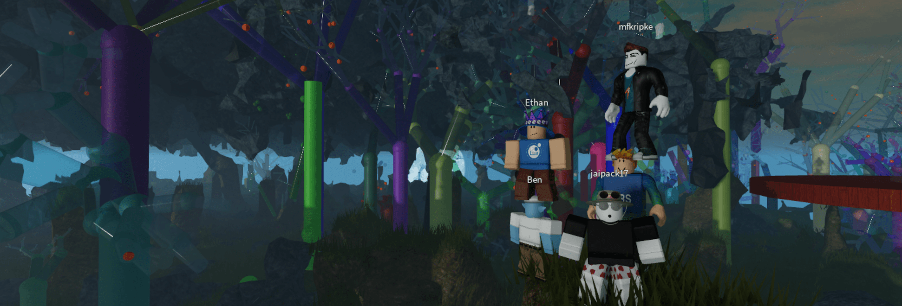

# Code

A seminar about the programming involved in building virtual worlds and the cool stuff that goes in them. Sometimes a livestream of construction of metauni, sometimes experts from the Roblox/Lua world talking about their stuff. The seminar is current on hiatus, see the [metauni homepage](https://www.metauni.org) for the schedule.

## Past seminars

* **5-11-21** Seminar 1: Tessell Tunes ([video](https://youtu.be/zAjl848o_fg), [game](https://www.roblox.com/games/7662464095/Tessell-Tunes))
* **11-11-21** Seminar 2: Tessell Tunes with zombies ([video](https://youtu.be/pKDruEjZPg8))
* **20-11-21** Seminar 3 (*AstroCode*): Fourier series ([video](https://youtu.be/F1gdI2eWqc8))
* **20-11-21** Seminar 4: ([video](https://youtu.be/dO3fi6WjjM0), [Songspires](https://www.roblox.com/games/8157928012/Songspires-metauni))
* **28-11-21** Seminar 5: Songspires remix ([video](https://youtu.be/wW3bEA-dcM8) and [download the Roblox Studio file](https://metauni.org/files/songspires.rbxl))
* **9-12-21** Seminar 6: Intro to metaboard ([video](https://youtu.be/3z6AK1KqqtQ))
* **17-12-21** Seminar 7: Adding hunt mode to Songspires ([video](https://youtu.be/7arwndlZMKo))
* **23-12-21** Seminar 8: Spatial voice ([video](https://youtu.be/ecCmWvCm1Ts))
* **6-1-22** Seminar 9: TeleportService ([video](https://youtu.be/RWP21_3xLc0))
* **13-1-22** Seminar 10: Attach as Luggage ([video](https://youtu.be/x3UDwI3FUFI))
* **20-1-22** (*[Jaipack](https://github.com/jaipack17/)*): [Nature2D](https://github.com/jaipack17/Nature2D) ([video](https://youtu.be/iJuSpmNAwEk), [presentation](https://quill-clam-cfe.notion.site/Nature2D-a5f61599d8ef4660861ea96a8f91fa7e)).
* **3-2-22** Seminar 11: History places for historical copies of boards ([video](https://youtu.be/UDx8K53Nd8g)).
* **10-2-22** Seminar 12 (*AstroCode*): Inverse kinematics ([video](https://youtu.be/2HZVDpbEB40)).
* **17-2-22** Seminar 13 (*[Mathias/draainhp](https://twitter.com/draainhp)*): Simulating physics ([video](https://youtu.be/JdWbr5AnHvI)).
* **3-3-22** Seminar 14 (*CodeSmoke*): On generating rails and roads ([video](https://youtu.be/DSo15XMjmek)).
* **10-3-22** Seminar 15 (*AstroCode*): Futurama tubes ([video](https://youtu.be/XB9NfkPO6d0)).
* **24-3-22** Seminar 16: Hacking on pockets and portals ([video](https://youtu.be/CF4ncxeO9mc)).
* **31-3-22** Seminar 17: Pockets again ([video](https://youtu.be/unvjvTxinr0)).
* **7-4-22** Seminar 18 (*AstroCode*): Arc-length parametrisation and Pneumatic tubes ([video](https://youtu.be/9eVCjRTnDrs)).
* **14-4-22** Seminar 19 (*AstroCode*): Frenet frames and completing the Pneumatic tubes ([video](https://youtu.be/m_ylyBAsvVM)).
* **5-5-22** Seminar 20 (*[Mathias/draainhp](https://twitter.com/draainhp)*): Tracking and firing at projectiles ([video](https://youtu.be/9P-2pipTUxk))
* **26-5-22** Seminar 21 (*AstroCode*): Catenaries ([video](https://youtu.be/0Vy7LiMGNnY))
* **2-6-22** Seminar 22 (*Peter McNeill*): Networking in ChickyNoid ([video](https://youtu.be/Y90hPDhz0Kc))
* **9-6-22** Seminar 23 (*Billy Snikkers*): Principles of Metaboard ([video](https://youtu.be/NQxE4H6JmQI))
* **16-6-22** Seminar 24 (*AstroCode*): AstroTubes ([video](https://youtu.be/ggpx--7Qn9A))
* **23-6-22** Seminar 25 (*AstroCode*): Voronoided ([video](https://youtu.be/7cWagvprVpY))
* **30-6-22** Seminar 26: Livecoding metaboard VR ([video](https://youtu.be/xlbvT6GvtWI))
* **7-7-22** Seminar 27: Celebrating metaboard v1 ([video](https://youtu.be/ZQMJ0VBdvYk))
* **14-7-22** Seminar 28 (*Ince*): Robust and Fast Collision Detection in Games ([video](https://youtu.be/trPYLf4SHLM))
* **21-7-22** Seminar 29: Excursion #1 ([video](https://youtu.be/zIrS_KSzNCY))
* **28-7-22** Seminar 30: Metaboard UI in VR, first steps ([video](https://youtu.be/cr4EYVwwkTE))
* **4-8-22** Seminar 31: Developer deeplinking in metaportal ([video](https://youtu.be/vSTaeQAjc98))
* **11-8-22** Seminar 32 (*AstroCode*): Becoming the cockroach ([video](https://youtu.be/i9_cRTy2qOk))
* **25-8-22** Seminar 33 (*Billy Snikkers*): Metaboard UI in VR ([video](https://youtu.be/fruZICH04fk))
* **1-9-22** Seminar 34: Game Jam 2022 ([video](https://youtu.be/lc8y0hnzLY8))
* **8-9-22** Seminar 35: Excursion #2 ([video](https://youtu.be/vrIPMpeAR6I))
* **15-9-22** Seminar 36: Building Big Sir ([video](https://youtu.be/9wQlirIU5uw))
* **22-9-22** Seminar 37: Putting pictures on boards ([video](https://youtu.be/UBhuBTIQGY4))
* **29-9-22** Seminar 38: How to build a gallery ([video](https://youtu.be/_wjqSjH0OYA))
* **6-10-22** Seminar 39: Odd jobs ([video](https://youtu.be/fYDQGUO4hhc))
* **13-10-22** Seminar 40: Building Cstar Bridge ([video](https://youtu.be/MqCZRIBgymk))
* **20-10-22** Seminar 41: Adding orbcam alternative views ([video](https://youtu.be/AS2jukP6PSU))
* **27-10-22** Seminar 42 (*AstroCode*): Vacuuming all the things ([video](https://youtu.be/yQA0HAWOJ8k))
* **3-11-22** Seminar 43 (*Billy Snikkers*): Billy Snikkers on Render, a lightweight Roact for metaboard ([video](https://youtu.be/rEuCCSAvRiw))
* **10-11-22** Seminar 44: Excursion #3 ([video](https://youtu.be/xczJ0w8w0l8))
* **24-11-22** (*[James Harland](http://titan.csit.rmit.edu.au/~e24991/)*): Teaching and learning in VR.
* **17-11-22** Seminar 45 (*Dan Murfet*): Adding AI agents to metauni ([video](https://youtu.be/gCbYcObguf8))
* **4-5-23** Seminar 46 (*Billy Snikkers*): Temporal Game State and Reactive UI ([video](https://youtu.be/cy7uF4_HO0I))
