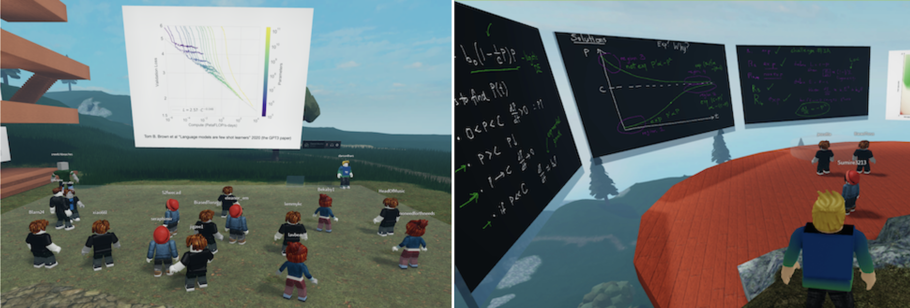

Metauni is a growing community of scholars in the Metaverse, based on a 3D virtual environment provided by [Roblox](https://www.roblox.com/), voice chat using [Discord](https://www.discord.com) and open source tools such as [whiteboards](https://github.com/metauni/metaboard) scripted in Luau. Access is possible on PC, Mac, iOS, Android and in VR.

**Quick start**: install [Roblox](https://www.roblox.com/) and [Discord](https://www.discord.com), join the [TRS Discord](https://discord.gg/9yBaAxPSK8), message `!register John123` in the `#registration` channel where `John123` is your Roblox username, and enter the [metauni Hub](https://www.roblox.com/games/8165000775/metauni-Hub). See the [instructions](https://metauni.org/posts/instructions/instructions) for more.

  <a href="https://twitter.com/_metauni">Twitter</a> |
  <a href="mailto:admin@metauni.org">Email</a> |
  <a href="https://www.youtube.com/playlist?list=PLKnx70LRf21eZQ7ZfEU5SibsJrAFvJU41">YouTube</a> |
  <a href="https://github.com/metauni">GitHub</a> |
  <a href="https://www.roblox.com/groups/13108882/metauni#!/about">Roblox</a>

> Yet it is not these gifts, nor the most determined ambition combined with irresistible will-power, that enables one to surmount the “invisible yet formidable boundaries” that encircle our universe. Only innocence can surmount them, which mere knowledge doesn’t even take into account, in those moments when we find ourselves able to listen to things, totally and intensely absorbed in child’s play -- Alexander Grothendieck

Subscribe to the [mailing list](https://tinyletter.com/adminmetauni) for announcements. If you want to see something *right now* go climb the knot in [The Rising Sea](https://www.roblox.com/games/8165217582/The-Rising-Sea). For information about past events and videos see the [events page](http://metauni.org/posts/events/events). The [metaboard](https://github.com/metauni/metaboard) is open source. You can see all the experiences that are part of metauni on our [group page](https://www.roblox.com/groups/13108882/metauni#!/about). See a problem? [File an issue](https://github.com/metauni/general/issues).

## metauni Day

We meet once a week for seminars. To join put yourself in the `General` voice channel in the TRS Discord, enter the [metauni Hub](https://www.roblox.com/games/8165000775/metauni-Hub) and click the "Join now" button on the What's On board. The 6-1-2022 sessions will use *Roblox voice-chat* as a trial, see the [instructions](https://metauni.org/posts/instructions/instructions).

**Dwarf block**:

Times are given on Thursday AEDT, the beginning of the block is: 9pm Wednesday UTC, 8am Thursday AEDT, 10pm Wednesday Paris, 9pm Wednesday London, 4pm Wednesday New York, 5am Thursday 南京.

* **Foundations 8:00-9:00** (*Billy Price, Will Troiani*): the nature of mathematical objects, logic, Gödel's theorems
* **Tea break 9:00-9:30**
* **Euclid 9:30-10:00** (*Ken Chan, Dan Murfet*): Euclid's Elements on virtual blackboards.
* **Singular Learning Theory 10:00-11:00** (*Edmund Lau, Liam Carroll, Ken Chan*): Singularities are knowledge.
* **Tea break 11:00-11:30**
* **SLT supplemental 11:30-12:00** (*Edmund Lau, Liam Carroll, Ken Chan*).
* **Code 12:00-1:00**: livestreaming the construction of metauni.
* **Tea break 1:00-1:30**
* **#metauni-dev 1:30-2:30**: development meeting.
* **Disruption 2:30-3:00** (*Adam Dorr*): towards a science of technological disruption.

**Elf block**:

Times are given on Thursday AEDT, the beginning of the block is: 10am Thursday UTC, 9pm Thursday AEDT, 11am Thursday Paris, 10am Thursday London, 5am Thursday New York, 6pm Thursday 南京.

* **Landau-Ginzburg 21:00-22:00** (*Rohan Hitchcock, Will Troiani, Dan Murfet*): on matrix factorisations and the bicategory of Landau-Ginzburg models.
* **Cryptography 22:00-23:00**: (*Eleanor McMurtry*) on [universal composability](https://en.wikipedia.org/wiki/Universal_composability).

Videos from previous weeks:

* *Euclid's Elements*: [seminar 2](https://youtu.be/VO6QPT8Ubcc), [seminar 3](https://youtu.be/4yLm7Wcj6zg), [seminar 6](https://youtu.be/8P5Q-YdPBB0), [seminar 7](https://youtu.be/J3NUps3RjWU), [seminar 8](https://youtu.be/YGeSrBkxIoc).
* *Foundations*: [seminar A](https://youtu.be/2S83EcpCKBY), [seminar B](https://youtu.be/hI3WKeaHCkk), [seminar 2](https://youtu.be/BxFr891R2k0), [seminar 3](https://youtu.be/sKJ5kbqYBBQ), [seminar 6](https://youtu.be/fpIXJ_X4XDM), [seminar 7](https://youtu.be/QfNGjmP65Fw), [seminar 8](https://youtu.be/kMhX5f0UN44).
* *Science of Disruption*: [seminar 1](https://youtu.be/4PDfwkXpXxk0), [seminar 2](https://youtu.be/nIZp83suxhg), [seminar 6](https://youtu.be/kzxozwtvTCo), [seminar 7](https://youtu.be/8geMAz9hlSA).
* *Code*: [seminar 1](https://youtu.be/zAjl848o_fg) ([Tessell Tunes](https://www.roblox.com/games/7662464095/Tessell-Tunes)), [seminar 2](https://youtu.be/pKDruEjZPg8) (Tessell Tunes remix), [seminar 3](https://youtu.be/dO3fi6WjjM0) ([Songspires](https://www.roblox.com/games/8157928012/Songspires-metauni)) and Songspires remix (some [video](https://youtu.be/wW3bEA-dcM8) and [download the Roblox Studio file](https://metauni.org/files/songspires.rbxl)), [seminar 6](https://youtu.be/3z6AK1KqqtQ) on metaboard, [seminar 7](https://youtu.be/7arwndlZMKo) adding hunt mode to Songspires, [seminar 8](https://youtu.be/ecCmWvCm1Ts) on spatial voice.
* *Guest speakers*: Ethan Curtiss (AstroCode) on [Fourier series](https://youtu.be/F1gdI2eWqc8).

## Build your own

While metauni is meta in the sense of being *in the Metaverse*, it is also meta in the sense that we want to help you how to build your own community like metauni. The simplest way is to use one of our private servers:

- [Circular Concept](https://www.roblox.com/games/8306474211/Circular-Concept#!/game-instances) with persistent metaboards, Admin Commands. `Free`.
- [Iteration of Concept](https://www.roblox.com/games/8278496526/Iteration-of-Concept) with metaboard, Admin Commands, and Coin Run challenge in an environment built from a snapshot of Songspire ([making of](https://youtu.be/l_Fl6tKZvQQ)). `Free`.
- [Random Concept](https://www.roblox.com/games/8343896302/Random-Concept) with persistent whiteboards, Admin Commands, 8-fold board, Weiqi board. `Free`.

Setup is easy: click on the `Servers` tab and `Create Private Server`. For more see the [private servers](http://metauni.org/posts/private/private) page.  If you feel comfortable with Roblox Studio, you can find our tools [here](https://metauni.org/posts/make-your-own/tools).
 
## Why?

We started running events in Roblox in 2020 due to COVID lockdowns in Melbourne, Australia. To our surprise we found that we actually enjoyed it, especially as compared to events in Zoom. It still isn't clear to us exactly *why* it is better, but here are some ideas:

1. **Creative Expression**. The ability to manifest your own will, creatively, in a shared space makes it feel real. This feeling of reality buttresses the rest of the experience. Creative acts range from the individual and simple (demonstrating your attention by following the speaker between boards, or saying "thanks" to the speaker by writing it in fancy colours on your personal board) to the social and complex (see the [Pillars Incident](https://youtu.be/jryDAxI3XSo)).

2. **No Video.** In Zoom the feeling of co-presence is based on being able to see other people's faces. This is better than lecturing to a blank screen, but it is also [exhausting](https://psycnet.apa.org/fulltext/2021-77825-003.pdf). In a 3D environment you get a sense of other people paying attention to what is going on, without having to constantly see their faces and your own.

3. **Play is Serious**. When unexpected things happen (red bouncy chairs, people abducting you in a floating boat, personal board climbing, etc) and they are fun, it reinforces a sense of shared experience and refills our "I want to be here" tank for a while. It seems that for virtual events to work, this mix of "serious" content and play needs to be carefully managed to keep these tanks nonempty.

> I really keenly feel that the 3d world adds a new dimension to the social interaction (since you are fixed in space in Zoom, I guess it actually adds three new dimensions). Just the fact that I can stand next to someone, even without saying a word, is a kind of connection that is really lacking in Zoom. Roblox events feel much more socially natural to me than video calls do (even without video). Imagine an in-person meeting, but instead of being free to move physically, you are strapped into a chair with your head facing forward. All of the other attendees have the same constraints. You proceed to inject your discussion into one another. That's what Zoom feels like in comparison to Roblox. -- a student

Roblox is a utility platform for large-scale 3D social environments (see [Baszucki keynote](https://www.youtube.com/watch?v=G00GlCJc0mU) and their [SEC S-1 filing](https://www.sec.gov/Archives/edgar/data/1315098/000119312520298230/d87104ds1.htm)). We chose Roblox because of its massive user base and accessibility on a wide array of platforms (43 million daily active users as of early 2021) and user-friendly tooling supported by many tutorials (Roblox Studio). It's remarkable that you can deploy an attractive 3D world with 100 simultaneous multiplayer users for free, in minutes, from your laptop. While you can make ugly things with Roblox, you can make [beautiful](https://www.roblox.com/games/3158922185/Toyokawa-Inari-Shrine-Showcase) [things](https://www.roblox.com/games/7056870928/Ancient-Machine-SHOWCASE) [too](https://www.roblox.com/games/6524322789/Garden-Of-Hestia-SHOWCASE).

Metauni is inspired by the [Free University of Berlin](https://en.wikipedia.org/wiki/Free_University_of_Berlin), [Lianda](https://en.wikipedia.org/wiki/National_Southwestern_Associated_University) and [Sabishii University](https://www.kimstanleyrobinson.info/content/shabishii).

## History

Current contributors are [Daniel Murfet](http://www.therisingsea.org) `starsonthars`, [Billy Price](https://billyprice.me/), James Clift, `BenSBk` and [Lucas Cantor](https://www.lucascantormusic.com/) `HeadOfMusic`.

* 14/1/2021 - History start, got Discord integration working, [intro video](https://youtu.be/0K3sCNvFpWE).
* 16/1/2021 - Update with clickable documents, audio plinths and working teleports, [another video](https://youtu.be/CJeuAvoRE9U).
* 17/1/2021 - Rewrote Discord bot to use MongoDB, fixed some bugs, implemented slide presentations ([video](https://youtu.be/9-fyJvrTRzA)).
* 17/1/2021 - Implemented popover "fullscreen" GUI for looking at slides, synced to the presenter's current slide. There is a [video](https://youtu.be/rNtZGYnRHdA) demoing this feature as well as recapping the other features.
* 18/1/2021 - Instructions for [building your own node](https://youtu.be/SEwmyMInqTM) to be read in conjunction with [this blog post](https://towardsdatascience.com/creating-a-discord-bot-from-scratch-and-connecting-to-mongodb-828ad1c7c22e) for the database and [this one](https://repl.it/talk/learn/Hosting-discordpy-bots-with-replit/11008) for keep alive (now superceded by Billy's excellent guide, see below).
* 20/1/2021 - Implemented the challenge system, with the first two challenges for the first event `#1A, #1B` see [challenges](http://metauni.org/posts/challenges/challenges).
* 20/1/2021 - BP has posted [detailed instructions](http://metauni.org/posts/make-your-own/make-your-own) for setting up your own node.
* 26/1/2021 - Discord bot rewritten by BP to use HTTP POST rather than a webhook, and repl.it database rather than MongoDB. The Rising Sea node has two new areas "Solar Peak" and the "Well of Past Events".
* 27/1/2021 - Social media accounts up and running (LC on Instagram, DM on Twitter).
* 31/1/2021 - Added new talk area for Ziling Ye's event (The Island).
* 1/2/2021 - Working whiteboards (by JC) and a new talk area (the Music Tower) for Lucas's event.
* 10/2/2021 - [Weiqi board](https://www.roblox.com/library/6366028251/metauni-Weiqi-Go-board) first release on the Roblox Toolbox (construction [video](https://youtu.be/wWtrTFI4ppc)).
* 11/2/2021 - [Whiteboard](https://www.roblox.com/library/6376883627/metauni-Whiteboard) and [Viewer](https://www.roblox.com/library/6377010705/metauni-Viewer) first release on the Roblox Toolbox (created by JC).
* 17/2/2021 - Updated whiteboards, now drawing is visible to new players in a server, significant performance improvements (JC).
* 18/2/2021 - New administration features: kick, ban, control of whiteboard access (by BP).
* 25/2/2021 - First public release of AdminCommands (by BP).
* 1/5/2021 - Updated whiteboards, new replay feature (by JC).
* 16/7/2021 - Public debut of the talking boards and the [locus](https://metauni.org/posts/loci/loci) concept.
* 22/7/2021 - Debut of the personal boards and rewritten code for the replay boards (by BP).
* 4/11/2021 - Debut of the "What's On" board in the metauni hub.
* 11/11/2021 - First VR test in a live event.
* 21/11/2021 - Personal whiteboards now support VR, and board subscriptions ([demo](https://youtu.be/brNGewzskBY)).
* 9/12/2021 - First open source of the [metaboard](https://github.com/metauni/metaboard).
* 18/12/2021 - First release of [private servers](https://metauni.org/posts/private/private).
* 23/12/2021 - First release of persistent boards.
* 27/12/2021 - First release of the [orb system](https://github.com/metauni/orb) for integrating Roblox's spatial voice into metauni.
* 29/12/2021 - Re-release of the [admin commands](https://github.com/metauni/admin) and update to use new boards.

Music in the Rising Sea:

* "Pop with Toys" by Lucas Cantor - in our [event video](https://youtu.be/xNqGxgiP0Cc) and on the audio plinth near the knot.
* "Forgotten Sacrifice" by Lucas Cantor - in the Cave of Forgotten Sacrifice
* "The Deification Of Naram-Sin" by Lucas Cantor - at the Solar Peak.
* "[A Metric Based on Insects](https://obduratefleet.bandcamp.com/album/obdurate)" by Will Troiani - in the Blind Cave.
