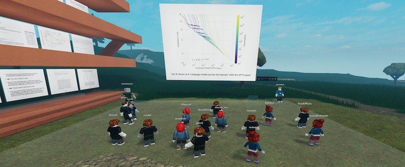

  <a href="https://www.roblox.com/games/6224932973/The-Rising-Sea">The Rising Sea</a> (<a href="https://discord.gg/9yBaAxPSK8">Discord</a>) |
  <a href="http://metauni.org/posts/make-your-own/make-your-own">Create your own node</a> |
  <a href="https://metauni.org/posts/rules/rules">Roblox rules</a>

Metauni is a network (like the World Wide Web) built out of paired [Roblox](https://www.roblox.com/) worlds and [Discord](https://www.discord.com) servers (webpages) connected by teleports (links). It is free in the sense of [freedom](https://en.wikipedia.org/wiki/Free_University_of_Berlin) and [freethought](https://en.wikipedia.org/wiki/Free_thought) and works on PC, Mac, iOS and Android. Roblox is a utility platform for large-scale 3D social environments (see [Baszucki keynote](https://www.youtube.com/watch?v=G00GlCJc0mU) and their [SEC S-1 filing](https://www.sec.gov/Archives/edgar/data/1315098/000119312520298230/d87104ds1.htm)). There's a [video intro](https://youtu.be/66MzfGqJFcA) (7min).

The purpose of this page is to help others set up nodes using metauni tools (see the Node Directory below) demonstrate best practices through our own nodes, and coordinate the development of open source tools (e.g. for uploading preprints and talk slides) and host announcements of virtual events. Code and demonstration levels are hosted [on Github](https://github.com/metauni/metauni-dev) and contributors are welcome. 

  <a href="mailto:admin@metauni.org">Email</a> |
  <a href="http://tinyletter.com/adminmetauni">Mailing list</a> |
  <a href="https://www.youtube.com/playlist?list=PLKnx70LRf21eZQ7ZfEU5SibsJrAFvJU41">YouTube</a> |
  <a href="https://instagram.com/metauni">Instagram</a> |
  <a href="https://twitter.com/_metauni">Twitter</a>

  

## Events

Events typically consist of a talk followed by [challenges](http://metauni.org/posts/challenges/challenges). You can [watch the video](https://youtu.be/xNqGxgiP0Cc) of our first event to see how it works. To receive announcements subscribe to the mailing list or follow us on Twitter.

Next event:

* **Friday 5/2/2021 10am-11am Melbourne (3-4pm Thursday in LA)**: Talk by [Lucas Cantor](https://www.lucascantormusic.com/) on music {`#2A`, `#2B`}. For the first time we'll run an optional pre-event session (from 20 minutes prior) where you can learn the math needed for challenge `#2A`. The venue is the Music Tower in [The Rising Sea](https://www.roblox.com/games/6224932973/The-Rising-Sea) ([Discord](https://discord.gg/9yBaAxPSK8)) (see Instructions below for how to join or [watch this](https://youtu.be/66MzfGqJFcA)). There will be directions to the tower posted in-world, you might like to join a few minutes early.
    - `-0:20-0:00` **Will Troiani** an introduction to group theory in music (using the new whiteboards).
    - `0:00-0:30` **Lucas Cantor** main event.
    - `0:30-0:40` Question time.
    - `0:40-1:00` Challenges `#2A`, `#2B`.

Upcoming events (challenges in `block`):

* **12/2/2021**: Community builder event {`no challenge`}.
* **19/2/2021**: Talk by [Adam Dorr](http://www.adamdorr.com/about/) on [disruption in energy policy](https://www.rethinkx.com/energy) {`#3A`, `#3B`}.
* **26/2/2021**: Community builder event {`no challenge`}.
* **5/3/2021**: Stories from Chinese history by award-winning playwright Ziling Ye {`#4A`, `#4B`}.

That will conclude "Season 1" and we'll take a bit of a break.

Past events:

* **29/1/2021**: Build Your Own Node event. In the first part DM and BP introduced the Roblox + Discord integration and walked people through setting up their own independent metauni nodes following [these instructions](http://metauni.org/posts/make-your-own/make-your-own) ([video](https://youtu.be/TDmMeR6O350)). In the second part JC and DM gave a livestream introducing Roblox Studio, the basics of coding in it, and some of the metauni objects ([video](https://youtu.be/W0SIAygiITs)) {`no challenge`}.
* **22/1/2021**: Talk by [Daniel Murfet](http://www.therisingsea.org) on deep learning theory ([video](https://youtu.be/xNqGxgiP0Cc), [lecture notes](https://www.dropbox.com/s/tc3mmw69lkqprta/DLT%20Lecture%201.pdf?dl=0), [slides](https://www.dropbox.com/s/g3yqxuy7pbvcv17/DLT1talk.pdf?dl=0)) {`#1A`, `#1B`}.

There is a brief [video guide](https://youtu.be/mA1X-aP-jBU) to attending talks.

## Instructions

### How do I get in?

In its current iteration localised voice chat in metauni is based on [Discord](https://www.discord.com), a popular real-time communication platform. Here are instructions for visiting a metauni node:

1. Create [Roblox](https://www.roblox.com/) and [Discord](https://www.discord.com) accounts and install both programs.
2. Enter the Discord server for the node (see the Node Directory, e.g. the [Rising Sea Discord](https://discord.gg/9yBaAxPSK8)).
3. On your first visit to the Discord server register your Roblox username with `!register <username>` (possibly the etiquette is to do this in a `#registration` channel).
4. Manually enter any Discord voice channel (e.g. General). Please use headphones to avoid feedback.
5. Enter the Roblox world by visiting its webpage and clicking on "Play" (again see the Node Directory, e.g. the [Rising Sea world](https://www.roblox.com/games/6224932973/The-Rising-Sea)).

This setup should work on PC, Mac, iOS and Android. Moreover, you can run the Discord and Roblox applications on different devices (i.e. run audio via Discord through your phone but Roblox on your computer).

Some notes on in-game controls and features:

* The translucent boxes are *voice chat zones* which transition your Discord into a specific voice channel when entered. Leaving the zone will not remove you from the channel. If you want to return to the General voice channel, click the "Reset" in the top right hand corner of your GUI.

* You move your player with the arrow keys (or WASD) and you can look around by holding down the right mouse button, or doing a two-finger drag on a trackpad. The control scheme can be changed in Settings (press Escape in-game to access).

* To interact with in-world GUI elements, such as buttons, you simply (left) click on them. Most of the white floating displays can be clicked on for a more readable popup view, including the presenter display in the talk zone.

* To use the in-game chat press `/`. It's convenient to quickly toggle between fullscreen and windowed, which is `fn + F11` on a Mac, but you'll have to first disable the "Show Desktop" shortcut in System Preferences.

* You can access animations, such as waves, by pressing `.`. You can enable additional animations on the Roblox website.

You should comply with the [Roblox rules](http://metauni.org/posts/rules/rules) while on their platform, and that includes the developer rules if you are creating your own nodes. These rules are in place to protect the children who spend a lot of time in Roblox, and seem to me well-intentioned and reasonable. However this does mean that you should **refrain from using the in-game chat or images to share URLs** or post Discord information inside your node. This coordination should happen on Discord or through some other channel. Finally, *do not under any circumstances climb the knot*.

### Troubleshooting

If you have trouble connecting to Roblox (and you have clicked Retry a few times) you might have to turn off your VPN. Some people have a better experience with the separate Discord application as compared to running Discord in the browser. You may have problems using Firefox on the Roblox site. If you use "!register" while already in a Roblox zone, you may have to click "Reset" in the top right hand corner of your GUI to join the voice channel.

### How do I host my own node?

Currently a metauni node consists of code inside a Roblox game talking to a Discord bot hosted on Repl.it. We have compiled [detailed instructions](http://metauni.org/posts/make-your-own/make-your-own) for setting up your own node and run regular drop-in sessions where you can get help (subscribe to the mailing list or follow us on Twitter for notifications).

### Does metauni violate Roblox rules?

Not as we currently understand them, but see our page on [Roblox rules](http://metauni.org/posts/rules/rules) for more information.

## Node directory

The _inner nodes_ (i.e. nodes where we take full responsibility for what happens):

* [The Rising Sea](https://www.roblox.com/games/6224932973/The-Rising-Sea) ([Discord](https://discord.gg/9yBaAxPSK8)). A collaboration of Daniel Murfet, Lucas Cantor and Ziling Ye.
* [Metauni hub](https://www.roblox.com/games/6233302798/Metauni-Hub) (no Discord).
* [jescuttle's testing ground](https://www.roblox.com/games/6306405136/jescuttles-testing-ground) (no Discord).
    
The _outer nodes_:

* [MUMS](https://www.roblox.com/games/6313764558/The-M-U-M-S-Room) ([Discord](https://discord.gg/x9UWUsw)).
* [LamamuLand](https://www.roblox.com/games/6313737040/Lamamu-Land) ([Discord](https://discord.gg/8mypEUk9)).
* [Bekaby](https://www.roblox.com/games/6313735851/Beks-Game) ([Discord](https://discord.gg/N4x6m2zG)).
* [Fleetwood Obdurate's place](https://www.roblox.com/games/6275923116/Fleetwood-Obdurates-Place) (no Discord).

Outer nodes may use some of the tools we have provided, and we may link to them on the metauni hub, but we have no control over the content of the Roblox worlds or their Discord channels.
 
## History

* 14/1/2021 - History start, got Discord integration working, [intro video](https://youtu.be/0K3sCNvFpWE).
* 16/1/2021 - Update with clickable documents, audio plinths and working teleports, [another video](https://youtu.be/CJeuAvoRE9U).
* 16/1/2021 - Quick [video](https://youtu.be/vkaBQw9-OBY) on understanding "Publish to Roblox".
* 17/1/2021 - Rewrote Discord bot to use MongoDB, fixed some bugs, implemented slide presentations ([video](https://youtu.be/9-fyJvrTRzA)).
* 17/1/2021 - Implemented popover "fullscreen" GUI for looking at slides, synced to the presenter's current slide. There is a [video](https://youtu.be/rNtZGYnRHdA) demoing this feature as well as recapping the other features.
* 18/1/2021 - How to attend an in-world talk ([video](https://youtu.be/mA1X-aP-jBU))
* 18/1/2021 - Instructions for [building your own node](https://youtu.be/SEwmyMInqTM) to be read in conjunction with [this blog post](https://towardsdatascience.com/creating-a-discord-bot-from-scratch-and-connecting-to-mongodb-828ad1c7c22e) for the database and [this one](https://repl.it/talk/learn/Hosting-discordpy-bots-with-replit/11008) for keep alive (now superceded by Billy's excellent guide, see below).
* 20/1/2021 - Development update: implemented "gather all" for voice channels ([video](https://youtu.be/GJunGvBGo6Y)) and implemented the challenge system, with the first two challenges for Friday's talk `#1A, #1B` see [challenges](http://metauni.org/posts/challenges/challenges).
* 20/1/2021 - Billy has posted [detailed instructions](http://metauni.org/posts/make-your-own/make-your-own) for setting up your own node.
* 26/1/2021 - Over the last week the Discord bot has been rewritten by Billy to use HTTP POST rather than a webhook, and now uses the repl.it database rather than MongoDB, among other improvements. This drastically simplifies the setup process, the guide to which has also been rewritten. The Rising Sea node has two new areas "Solar Peak" and the "Well of Past Events".
* 27/1/2021 - Social media accounts up and running (Lucas on Instagram, Dan on Twitter).

Current contributors are [Daniel Murfet](http://www.therisingsea.org) `starsonthars`, [Billy Price](https://billyprice.me/), James Clift and [Lucas Cantor](https://www.lucascantormusic.com/) `HeadOfMusic`.

Music in the Rising Sea node:

* "Pop with Toys" by Lucas Cantor - in our [event video](https://youtu.be/xNqGxgiP0Cc) and on the audio plinth near the knot.
* "Forgotten Sacrifice" by Lucas Cantor - in the Cave of Forgotten Sacrifice
* "The Deification Of Naram-Sin" by Lucas Cantor - at the Solar Peak.
* "[A Metric Based on Insects](https://obduratefleet.bandcamp.com/album/obdurate)" by Will Troiani - in the Blind Cave.
