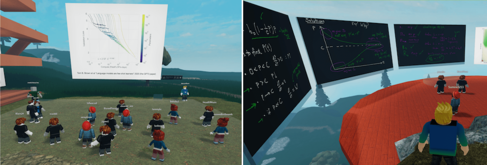

Metauni is a community of scholars in the Metaverse, with 3D virtual environment and voice chat provided by [Roblox](https://www.roblox.com/) and whiteboards and other [open source tools](https://metauni.org/posts/open/open) scripted in Luau. We use [Discord](https://www.discord.com) for livestreams and community organisation. All are welcome and it's easy to join in, follow the [instructions](https://metauni.org/posts/instructions/instructions) and then **[Enter the Hub](https://www.roblox.com/games/8165000775/metauni-Hub)**.
 

  <a target="_blank" href="https://discord.gg/9yBaAxPSK8">Discord</a> |
  <a target="_blank" href="https://www.youtube.com/playlist?list=PLKnx70LRf21eZQ7ZfEU5SibsJrAFvJU41">YouTube</a> |
  <a target="_blank" href="https://github.com/metauni">GitHub</a> |
  <a target="_blank" href="https://www.roblox.com/groups/13108882/metauni#!/about">Roblox Group</a> |
  <a target="_blank" href="https://twitter.com/_metauni">Twitter</a> |
  <a target="_blank" href="mailto:admin@metauni.org">Email</a>

<iframe width="800" height="450" src="https://www.youtube.com/embed/FtAna8-T4Ms" title="YouTube video player" frameborder="0" allow="accelerometer; autoplay; clipboard-write; encrypted-media; gyroscope; picture-in-picture" allowfullscreen></iframe>

> Yet it is not these gifts, nor the most determined ambition combined with irresistible will-power, that enables one to surmount the “invisible yet formidable boundaries” that encircle our universe. Only innocence can surmount them, which mere knowledge doesn’t even take into account, in those moments when we find ourselves able to listen to things, totally and intensely absorbed in child’s play -- Alexander Grothendieck

## metauni Algebraic Geometry

Starting June 16th we are running a free 8-week introductory course on algebraic geometry, that we call [MAG](https://www.metauni.org/mag). This is open to anybody and the pre-requisites are high school algebra and a bit of linear algebra. Registration is now open!

## metauni Day

We meet once a week for seminars. To join enter the [metauni Hub](https://www.roblox.com/games/8165000775/metauni-Hub) and click the "Join now" button on the What's On board. All are welcome, but some seminars are more technical than others: **Euclid** is at the level of high school geometry and is intended to be widely accessible, **Disruption** is non-technical and **Cell Learning Theory** requires only a basic background in cell biology. Click the name of the seminar for a detailed schedule of future talks and links to videos of past talks.

**Dwarf block**: Times are given on Thursday AEST. Names in italics are the co-organisers of the seminar.
<!-- BEGIN WHATS ON -->
* **[metauni Algebraic Geometry](https://metauni.org/mag/)** **07:00-08:30** (*Ken Chan, Dan Murfet*): pre-course #2
* **Tea break** **08:30-09:00**
* **[Singular Learning Theory](https://metauni.org/posts/events/seminar-slt)** **09:00-10:00** (*Edmund Lau*): singularities are knowledge. A learning seminar on Watanabe’s Singular Learning Theory, which applies algebraic geometry to statistical learning theory. One of the aims is to contribute to the mathematical theory of deep learning. *This week*: working session.
* **Tea break** **10:00-10:30**
* **[Disruption](https://metauni.org/posts/events/seminar-disruption)** **10:30-11:30** (*Adam Dorr*): towards a science of technological disruption. An open discussion of technological disruption, how it works, what it means and how to play a positive part in it.
* **[Code](http://metauni.org/posts/events/seminar-code)** **11:30-12:30** (*Ethan Curtiss*): coding and math in Roblox (in the [Discord](https://discord.gg/9yBaAxPSK8)). Sometimes we livestream working on metauni infrastructure, and sometimes we have guest speakers from the Roblox dev community presenting interesting projects they are working on. *This week* Billy Price on multi-user interaction in metaboard.
* **#metauni-dev** **12:30-13:30**: development meeting (in the [Discord](https://discord.gg/9yBaAxPSK8)).
* **AI Safety** **21:00-22:00**: A reading group on technical and philosophical topics in AI Safety.
<!-- END WHATS ON -->

**Not on this week**:
<!-- BEGIN WHATS OFF -->
* **[Cryptography](https://lnor.net/uc-seminar.html)** **20:00-21:00** (*Eleanor McMurtry*): on [zero knowledge proofs](https://en.wikipedia.org/wiki/Zero-knowledge_proof) *returns 9/6/22*
* **Cell Learning Theory** **08:00-09:00** (*Dan Murfet*): learning and computation in biology. *Next week*: thermodynamics of computation.
* **[Euclid](http://metauni.org/posts/events/seminar-euclid)** (*Ken Chan, Dan Murfet*): Euclid’s Elements on virtual blackboards. *on hiatus*
* **[Landau-Ginzburg](http://metauni.org/posts/events/seminar-lg)** (*Dan Murfet*): on the geometry and (bi)category theory of isolated hypersurface singularities. *on hiatus*
* **[Foundations](http://metauni.org/posts/events/seminar-foundations)** (*Billy Price, Will Troiani*): the nature of mathematical objects, logic, Gödel’s theorems. Currently in the middle of proving Gödel’s incompleteness theorems. *on hiatus*
<!-- END WHATS OFF -->

For videos from the seminars, see the pages for the individual seminars (linked above) or the [YouTube channel](https://www.youtube.com/playlist?list=PLKnx70LRf21eZQ7ZfEU5SibsJrAFvJU41). If you are a speaker in one of the seminars, see the [instructions for speakers](https://metauni.org/posts/instructions/instructions-admin). For information about past events and videos see the [events page](http://metauni.org/posts/events/events).

## Upcoming events

* [metauni Algebraic Geometry](https://metauni.org/mag/) (MAG) class starting mid-June 2022.
* The second "Festival of Research" will be held on the same day that MAG starts. Confirmed speakers so far: Rohan Hitchcock, Aidan, Eleanor McMurtry, Will Troiani, Isaac Smith.

## Build your own

While metauni is meta in the sense of being *in the Metaverse*, it is also meta in the sense that we want to help you how to build your own community like metauni. The tools we use are [open source](https://metauni.org/posts/open/open) and we'll happily help you set up your own seminars and teach you how to record them, just jump into the Discord and say hi. If you'd rather not open up Roblox Studio, one simple way to run a seminar is to use one of our private servers:

- [Circular Concept](https://www.roblox.com/games/8306474211/Circular-Concept#!/game-instances) with persistent metaboards, Admin Commands. `Free`.
- [Iteration of Concept](https://www.roblox.com/games/8278496526/Iteration-of-Concept) with metaboard, Admin Commands, and Coin Run challenge in an environment built from a snapshot of Songspire ([making of](https://youtu.be/l_Fl6tKZvQQ)). `Free`.
- [Random Concept](https://www.roblox.com/games/8343896302/Random-Concept) with persistent whiteboards, Admin Commands, 8-fold board, Weiqi board. `Free`.

Setup is easy: click on the `Servers` tab and `Create Private Server`. For more see the [private servers](http://metauni.org/posts/private/private) page.

## Why?

We started running events in Roblox in 2020 due to COVID lockdowns in Melbourne, Australia. To our surprise we found that we actually enjoyed it, especially as compared to events in Zoom. It still isn't clear to us exactly *why* it is better, but here are some ideas:

1. **Creative Expression**. The ability to manifest your own will, creatively, in a shared space makes it feel real. This feeling of reality buttresses the rest of the experience. Creative acts range from the individual and simple (demonstrating your attention by following the speaker between boards, or saying "thanks" to the speaker by writing it in fancy colours on your personal board) to the social and complex (see the [Pillars Incident](https://youtu.be/jryDAxI3XSo)).

2. **No Video.** In Zoom the feeling of co-presence is based on being able to see other people's faces. This is better than lecturing to a blank screen, but it is also [exhausting](https://psycnet.apa.org/fulltext/2021-77825-003.pdf). In a 3D environment you get a sense of other people paying attention to what is going on, without having to constantly see their faces and your own.

3. **Play is Serious**. When unexpected things happen (red bouncy chairs, people abducting you in a floating boat, personal board climbing, etc) and they are fun, it reinforces a sense of shared experience and refills our "I want to be here" tank for a while. It seems that for virtual events to work, this mix of "serious" content and play needs to be carefully managed to keep these tanks nonempty.

> I really keenly feel that the 3d world adds a new dimension to the social interaction (since you are fixed in space in Zoom, I guess it actually adds three new dimensions). Just the fact that I can stand next to someone, even without saying a word, is a kind of connection that is really lacking in Zoom. Roblox events feel much more socially natural to me than video calls do (even without video). Imagine an in-person meeting, but instead of being free to move physically, you are strapped into a chair with your head facing forward. All of the other attendees have the same constraints. You proceed to inject your discussion into one another. That's what Zoom feels like in comparison to Roblox. -- a student

Roblox is a utility platform for large-scale 3D social environments (see [Baszucki keynote](https://www.youtube.com/watch?v=G00GlCJc0mU) and their [SEC S-1 filing](https://www.sec.gov/Archives/edgar/data/1315098/000119312520298230/d87104ds1.htm)). We chose Roblox because of its massive user base and accessibility on a wide array of platforms (43 million daily active users as of early 2021) and user-friendly tooling supported by many tutorials (Roblox Studio). It's remarkable that you can deploy an attractive 3D world with 100 simultaneous multiplayer users for free, in minutes, from your laptop. While you can make ugly things with Roblox, you can make [beautiful](https://www.roblox.com/games/3158922185/Toyokawa-Inari-Shrine-Showcase) [things](https://www.roblox.com/games/7056870928/Ancient-Machine-SHOWCASE) [too](https://www.roblox.com/games/6524322789/Garden-Of-Hestia-SHOWCASE).

Metauni is inspired by the [Free University of Berlin](https://en.wikipedia.org/wiki/Free_University_of_Berlin), [Lianda](https://en.wikipedia.org/wiki/National_Southwestern_Associated_University) and [Sabishii University](https://www.kimstanleyrobinson.info/content/shabishii).

## History

Current contributors are [Daniel Murfet](http://www.therisingsea.org) `starsonthars`, [Lucas Cantor](https://www.lucascantormusic.com/) `HeadOfMusic`, James Clift, [Billy Price](https://billyprice.me/), [Ethan Curtiss](https://github.com/EthanCurtiss), [BenSBk](https://github.com/BenSBk), [jaipack17](https://jaipack17.github.io), [madeline](https://violetsky.dev).

* 14/1/2021 - History start, got Discord integration working, [intro video](https://youtu.be/0K3sCNvFpWE).
* 16/1/2021 - Update with clickable documents, audio plinths and working teleports, [another video](https://youtu.be/CJeuAvoRE9U).
* 17/1/2021 - Rewrote Discord bot to use MongoDB, fixed some bugs, implemented slide presentations ([video](https://youtu.be/9-fyJvrTRzA)).
* 17/1/2021 - Implemented popover "fullscreen" GUI for looking at slides, synced to the presenter's current slide. There is a [video](https://youtu.be/rNtZGYnRHdA) demoing this feature as well as recapping the other features.
* 18/1/2021 - Instructions for [building your own node](https://youtu.be/SEwmyMInqTM) to be read in conjunction with [this blog post](https://towardsdatascience.com/creating-a-discord-bot-from-scratch-and-connecting-to-mongodb-828ad1c7c22e) for the database and [this one](https://repl.it/talk/learn/Hosting-discordpy-bots-with-replit/11008) for keep alive (now superceded by Billy's excellent guide, see below).
* 20/1/2021 - Implemented the challenge system, with the first two challenges for the first event `#1A, #1B` see [challenges](http://metauni.org/posts/challenges/challenges).
* 20/1/2021 - BP has posted [detailed instructions](http://metauni.org/posts/make-your-own/make-your-own) for setting up your own node.
* 26/1/2021 - Discord bot rewritten by BP to use HTTP POST rather than a webhook, and repl.it database rather than MongoDB. The Rising Sea node has two new areas "Solar Peak" and the "Well of Past Events".
* 27/1/2021 - Social media accounts up and running (LC on Instagram, DM on Twitter).
* 31/1/2021 - Added new talk area for Ziling Ye's event (The Island).
* 1/2/2021 - Working whiteboards (by JC) and a new talk area (the Music Tower) for Lucas's event.
* 10/2/2021 - [Weiqi board](https://www.roblox.com/library/6366028251/metauni-Weiqi-Go-board) first release on the Roblox Toolbox (construction [video](https://youtu.be/wWtrTFI4ppc)).
* 11/2/2021 - [Whiteboard](https://www.roblox.com/library/6376883627/metauni-Whiteboard) and [Viewer](https://www.roblox.com/library/6377010705/metauni-Viewer) first release on the Roblox Toolbox (created by JC).
* 17/2/2021 - Updated whiteboards, now drawing is visible to new players in a server, significant performance improvements (JC).
* 18/2/2021 - New administration features: kick, ban, control of whiteboard access (by BP).
* 25/2/2021 - First public release of AdminCommands (by BP).
* 1/5/2021 - Updated whiteboards, new replay feature (by JC).
* 16/7/2021 - Public debut of the talking boards and the [locus](https://metauni.org/posts/loci/loci) concept.
* 22/7/2021 - Debut of the personal boards and rewritten code for the replay boards (by BP).
* 4/11/2021 - Debut of the "What's On" board in the metauni hub.
* 9/12/2021 - First open source release of the [metaboard](https://github.com/metauni/metaboard) (BP).
* 18/12/2021 - First release of [private servers](https://metauni.org/posts/private/private).
* 23/12/2021 - First release of persistent boards.
* 27/12/2021 - First release of the [orb system](https://github.com/metauni/orb) for integrating Roblox's spatial voice into metauni.
* 29/12/2021 - Re-release of the [admin commands](https://github.com/metauni/admin) and update to use new boards.
* 8/1/2022 - Switch to spatial voice for metauni events.
* 27/1/2022 - Integration of the Avatar Editor (by [phoebe](https://violetsky.dev)).
* 8/6/2022 - Automated schedule deployment system (by Ethan and phoebe).

Music in the Rising Sea:

* "Pop with Toys" by Lucas Cantor - in our [event video](https://youtu.be/xNqGxgiP0Cc) and on the audio plinth near the knot.
* "Forgotten Sacrifice" by Lucas Cantor - in the Cave of Forgotten Sacrifice
* "The Deification Of Naram-Sin" by Lucas Cantor - at the Solar Peak.
* "[A Metric Based on Insects](https://obduratefleet.bandcamp.com/album/obdurate)" by Will Troiani - in the Blind Cave.
