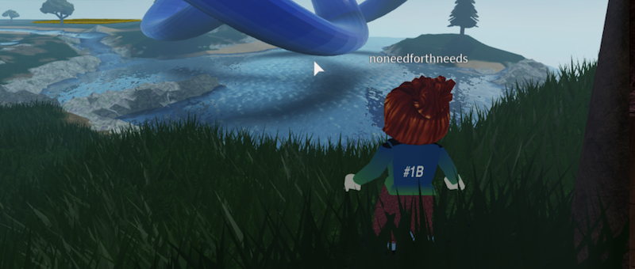

# Challenges

You can see the challenges [in action](https://youtu.be/xNqGxgiP0Cc?t=1440) at our first event.

| ID | Difficulty | Winner | Item | Transaction ID |
| :--: | :----------: | :------: | :-----: | :--------------: |
| `#1A - Ascend the knot` | 10 | `Fleetwood_Obdurate` |  | |
| `#1B - Find 3 Guqin players` | 5 | `noneedforthneeds` |  | |
| `#2A - Chinese Remainder Theorem` | 40 | `jescuttle`, `sneetchbeaches` | | |
| `#2B - Coin hunt` | 20 | `mfkripke`, `eleanor_em` | | |
| `#3A` | | | | |
| `#3B` | | | | |
| `#4A` | | | | |
| `#4B - 孔明灯` | | | | |

From the second talk one of the challenges (`A` series) will be mathematical challenges of various difficulty, ranging from high-school math to calculations with mixed Hodge structures. The other challenge (`B` series) will be a more video-game style minigame.

  

