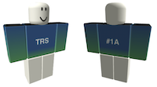
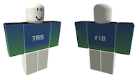

# Challenges

Prizes are unique Roblox items.

| ID | Difficulty | Winner | Prize | Transaction ID |
| :--: | :----------: | :------: | :-----: | :--------------: |
| `#1A` | 10 | `Fleetwood_Obdurate` |  | |
| `#1B` | 5 | `noneedforthneeds` |  | |
| `#2A` | | | | |
| `#2B` | | | | |
| `#3A` | | | | |
| `#3B` | | | | |
| `#4A` | | | | |
| `#4B - 孔明灯` | | | | |

From the second talk one of the challenges (`A` series) will be mathematical challenges of various difficulty, ranging from high-school math to calculations with mixed Hodge structures. The other challenge (`B` series) will be a more video-game style minigame.

## Collecting prizes

To collect your prize, you "buy" it from one of the metauni administrator accounts using Robux provided in a Roblox gift card (believe it or not this seems to be the simplest way to transfer an item). 

If you won a challenge, email <admin@metauni.org> with your Roblox username and you will receive an email with a Roblox gift card and a separate email from <admin@metauni.org> with a link to the prize. Click the "View my digital gift card" link in the first email, and copy the digital gift card number to your clipboard. Then click on the link to redeem on Roblox. Finally use the link provided in the second email to buy the prize with the provided Robux. Once an administrator sees you have completed the transaction the prize item will be delisted from the store.

If you want to verify that you are the sole owner of the prize, get the ID of the item from its URL (e.g. `102611803` from `https://www.roblox.com/catalog/102611803/Verified-Bonafide-Plaidafied`) and then go to `https://api.roblox.com/Marketplace/ProductInfo?assetId=<ITEM-ID>` and look for `"Sales":` in the resulting JSON (yes I know). Note that the Challenge `#1A` prize has two sales as it was used for debugging the above, but one of the sales was to myself and was deleted (promise).
