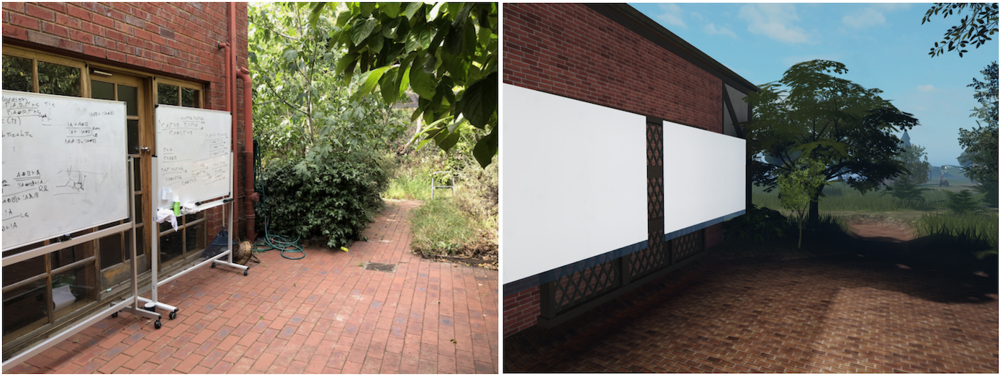

# Dual spaces (experimental)

A _dual space_ is a pair consisting of a physical and virtual location (a metauni node) bound together with code. The goal of a dual space is to put physical and virtual attendees (at a seminar, lecture or working group) on an equal footing, via bidirectional propagation of audio and writing between the physical and virtual spaces.

  

Currently we are experimenting with such pairings for physical boards and virtual boards, with the following protocol (a work in progress):

* Each physical board is paired with a virtual board. There may be more virtual boards than physical boards.
* If you want to write on a physical board, appoint a _scribe_ who will mirror what you write on the corresponding virtual board. Failing to do this is a *faux pas* while in a dual space.
* Use iPads to write to virtual boards that have no corresponding physical board.
* Those speaking at a physical board should have headphones in, with a phone in their pocket active on Discord (both so virtual attendees can hear them speak, and so they can hear questions from virtual attendees)
* In a group discussion with a virtual member, everyone in the group should try to have headphones in with at least one active mic, so that the virtual member can hear and be heard.
