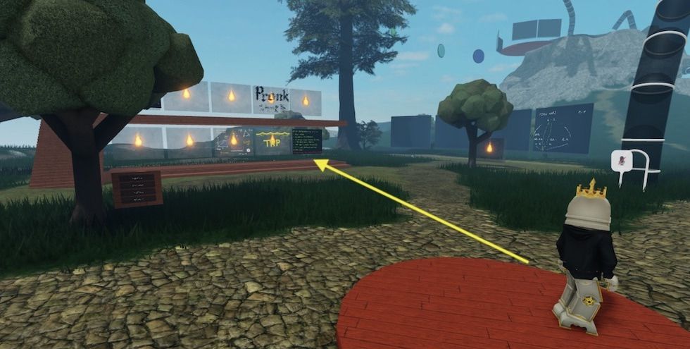

---
title:
    AI safety reading group
description:
    preventing civilisation from destroying itself
---

AI safety reading group
=======================

Weekly discussions of readings on technical and philosophical topics in
AI safety.

AI Safety is the field trying to figure out how to stop AI systems from
breaking the world, and in particular, trying to do so before they break
the world.
Readings will span from potential issues arising from future advanced
AI systems, to technical topics in AI control, to present-day issues.

Seminar information:

* **Organisers:**
  Matthew Farrugia-Roberts and Dan Murfet.
* **Time:**
  Thursday evenings, 9pm AEST, most weeks
  (see [home page](/) for most up-to-date schedule).
* **Venue:**
  [The Rising Sea](https://www.roblox.com/games/8165217582/The-Rising-Sea).

Directions for joining discussions:

0. New to metauni?
   Follow [these instructions](/posts/instructions/instructions)
   to get started (including: join the Discord server, create a Roblox
   account, enable Roblox voice chat).
1. Launch the Roblox experience
   [The Rising Sea](https://www.roblox.com/games/8165217582/The-Rising-Sea).
2. Step into matomatical's portal (bottom-right corner of stack), or
   use the menu: "Pockets" > "Go to pocket" > type address "Gemini Pulsar 1".
   

Readings
--------

Completing weekly readings is recommended, but ultimately optional.
The discussion sessions begin with a summary of the reading, lead by Matt
(unless otherwise noted).

Upcoming readings and discussions:

* There will be no discussion on **2022.07.07** or **2022.07.14**;
  we will resume on **2022.07.21** with a reading to be announced.

Past readings and discussions:

* **2022.06.09:**
  Norbert Wiener,
  1960,
  "Some moral and technical consequences of automation",
  *Science*.

* **2022.06.16:**
  Stephen M. Omohundro,
  2008,
  "The basic AI drives",
  *Proceedings of the 2008 conference on Artificial General Intelligence*.

* **2022.06.23:**
  Nick Bostrom,
  2012,
  "The superintelligent will: Motivation and instrumental rationality in
  advanced artificial agents",
  *Minds and Machines*.

* **2022.06.30:**
  Rachel Thomas and Louisa Bartolo, 2022,
  "AI harms are societal, not just individual",
  [fast.ai blog](https://www.fast.ai/2022/05/17/societal-harms/).
  Discussion lead by Dan.

Topics brainstorm
-----------------

The nature of superintelligence:

* Key chapters of Bostrom's *Superintelligence*
* On embedded agency (Demski & Garrabrant, 2020)
* Eric Drexler's report *Reframing Superintelligence*
  / Comprehensive AI Services (CAIS)

Aligning superintelligences:

* Key chapters of Stuart Russell's *Human Compatible*
* Papers on CIRL / assistance games
* Papers on corrigibility
* Papers on the off-switch game
* Papers on mesa optimisation / optimisation daemons
* Papers on the complexity of values thesis
* Key chapters of Brian Christian's *The Alignment Problem*

Present-day issues:

* On algorithmic bias
* On interpretability
* On aligning recommender systems

Future philosophy

* On future digital ethics
* On machine consciousness

Sources of readings (clearly with much mutual overlap):

* Matt's lists (TODO: share them).
* Victoria Krakovna's
  [resource](https://vkrakovna.wordpress.com/2016/02/28/introductory-resources-on-ai-safety-research/)
  [lists](https://vkrakovna.wordpress.com/ai-safety-resources/).
* Rohin Shah's
  [2018/2019 review](https://www.alignmentforum.org/posts/dKxX76SCfCvceJXHv/ai-alignment-2018-19-review).
* CHAI AI safety [bibliography](https://humancompatible.ai/bibliography)
* Publications from
  [MIRI](https://intelligence.org/research/#publications),
  [FHI](http://www.fhi.ox.ac.uk/publications/), etc.
* The old 80kh AI safety
  [syllabus](https://80000hours.org/articles/ai-safety-syllabus/)
  and links therein (esp. EA Cambridge syllabus).
