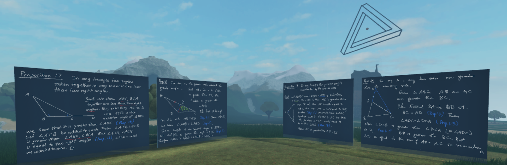

# Euclid

Euclid's elements on virtual blackboards.

**Co-organisers**: Ken Chan and Dan Murfet.

## Past seminars

* [seminar 1](https://youtu.be/9U73KputtOU)
* [seminar 2](https://youtu.be/VO6QPT8Ubcc)
* [seminar 3](https://youtu.be/4yLm7Wcj6zg)
* [seminar 6](https://youtu.be/8P5Q-YdPBB0)
* [seminar 7](https://youtu.be/J3NUps3RjWU)
* [seminar 8](https://youtu.be/YGeSrBkxIoc).
