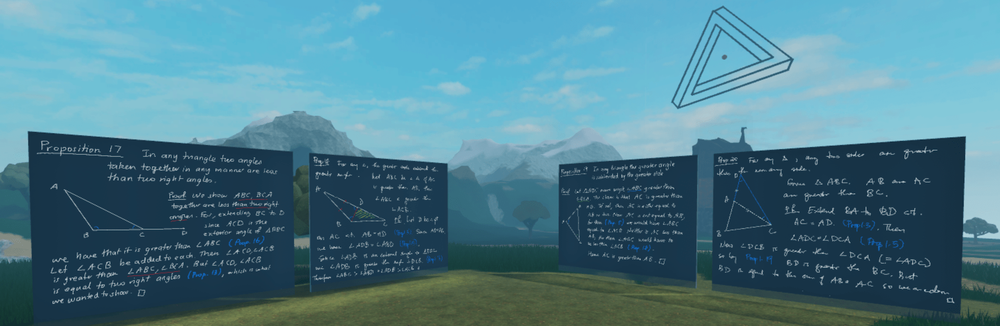

# Euclid

Euclid's elements on virtual blackboards. Thursdays `9:30am-10:00am AEDT`.

* **Co-organisers**: Ken Chan and Dan Murfet.
* **Venue**: the [Rising Sea](https://www.roblox.com/games/8165217582/The-Rising-Sea).

## Past seminars

* [Seminar 1](https://youtu.be/9U73KputtOU): Postulates and Proposition 1.
* [Seminar 2](https://youtu.be/VO6QPT8Ubcc): Propositions 2, 3.
* [Seminar 3](https://youtu.be/4yLm7Wcj6zg): Propositions 4, 5.
* [Seminar 4](https://youtu.be/EBgNmbNglYY): Propositions 6, 7, 9.
* Seminar 5 *no recording*.
* [Seminar 6](https://youtu.be/8P5Q-YdPBB0): Propositions 11, 12, 13.
* [Seminar 7](https://youtu.be/J3NUps3RjWU): Propositions 14, 15, 16.
* [Seminar 8](https://youtu.be/YGeSrBkxIoc): Propositions 17, 18, 19, 20.
* [Seminar 9](https://youtu.be/0VNxaqiIvG0): Propositions 21, 22.
* [Seminar 10](https://youtu.be/eQ7ryFLQDxw): Propositions 23, 24.
* [Seminar 11](https://youtu.be/1G9TY-alLJY): Propositions 25, 26.
* [Seminar 12](https://youtu.be/s1_fyN1mgWw): Propositions 27, 28.
* **17-2-22** Seminar 13: Propositions 29, 30 and the fifth postulate ([video](https://youtu.be/s1CsTWw7cAw)).
* **24-2-22** Seminar 14: Proposition 31 ([video](https://youtu.be/yAtkz7CvlTU))
* **3-3-22** Seminar 15: Propositions 34, 35 ([video](https://youtu.be/5OKFSOs8po8)).
* **10-3-22** Seminar 16: Propositions 36, 37 ([video](https://youtu.be/iDl0ieEeGRw)).
* **17-3-22** Seminar 17: Propositions 38, 39, 40, 41 ([video](https://youtu.be/Z0I4jJxwZW8)).
* **24-3-22** Seminar 18: Propositions 42, 43 ([video](https://youtu.be/bp1woK8Qz5Q)).
* **31-3-22** Seminar 19: Proposition 44 ([video]()).
