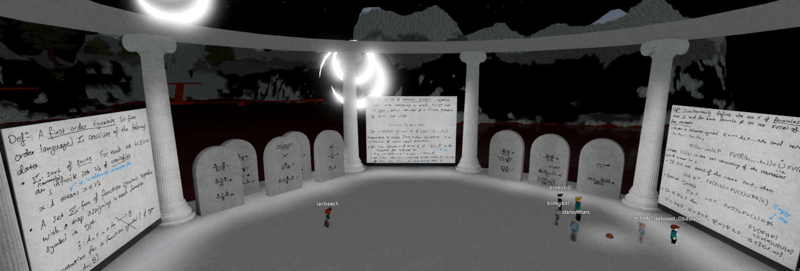

# Foundations seminar

A seminar on the nature of mathematical objects, logic, Gödel's theorems. Thursdays `8:00am-9:00am AEDT`.

* **Co-organisers**: Billy Price and Will Troiani.
* **Venue**: [Deprecation](https://www.roblox.com/games/8164849103/Deprecation).

## Past seminars

* [Seminar 1A](https://youtu.be/2S83EcpCKBY): variables, terms, relation symbols, function symbols, formulas and free variables.
* [Seminar 1B](https://youtu.be/hI3WKeaHCkk): first order languages, interpretations and theories.
* [Seminar 2](https://youtu.be/BxFr891R2k0): natural deduction as a proof system I.
* [Seminar 3](https://youtu.be/sKJ5kbqYBBQ): natural deduction as a proof system II, soundness.
* [Seminar 6](https://youtu.be/fpIXJ_X4XDM): discharging hypotheses and Curry-Howard.
* [Seminar 7](https://youtu.be/QfNGjmP65Fw): any consistent, complete and saturated system is satisfiable.
* [Seminar 8](https://youtu.be/kMhX5f0UN44): Completeness theorem. 
* [Seminar 9](https://youtu.be/TRhR88anv3M): Gödel's theorem I
* [Seminar 10](https://youtu.be/GQ4DFMNKvwY): Gödel's theorem II
* **10-2-22** (*Will Troiani*): Gödel's incompleteness theorem Part 3 ([video](https://youtu.be/hz-IWh9CF9A)).
* **17-2-22** (*Will Troiani*): Gödel's incompleteness theorem Part 4 ([video](https://youtu.be/KxnE1mwRG-k)).
* **3-3-22** (*Will Troiani*): Gödel's incompleteness theorem Part 5.
