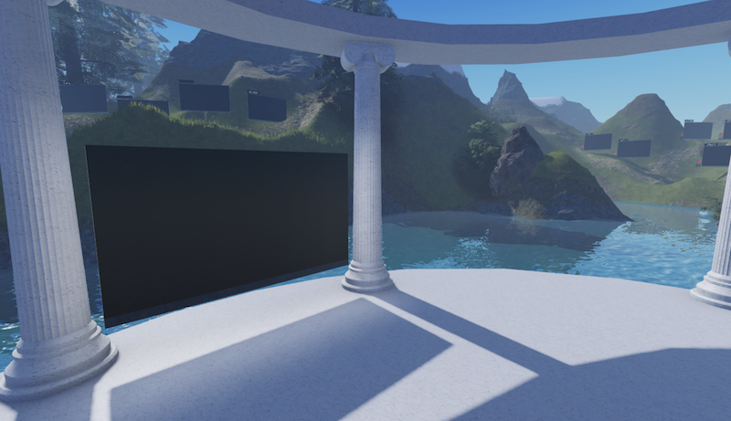

# Loci

A [locus](https://en.wikipedia.org/wiki/Method_of_loci) is a place for focused intellectual activity, with a *Stage*, *Board Trails* and *Art*. The stage is where live events and classes are held. Winding through the landscape are talking boards, from which you can learn at your own pace as an individual or in a group, supported by office hours. Finally, the art might be sculpture, flying bat-dolphins with riddles, music hidden in alcoves, etc.

  

It is recommended that you use a tablet and stylus (e.g. an Apple iPad and Pencil). To join a locus you'll need Roblox and Discord, see the [instructions](https://metauni.org/posts/instructions/instructions). To view a talking board, the best idea is to either click on it or go into "first person" mode by either using the scrollwheel on your mouse, the I/O keys on your keyboard, or pinching to zoom in.

>  I think the more the Roblox map feels like a persistent, unified environment the more psychologically equivalent it will be to a physical campus; the more certain locations become associated with certain kinds of activities and discussions, and perhaps if they are geographically connected in some kind of mathematical archipelago, the more the virtual world will start to develop its own culture and atmosphere.    -- Adrian Xu

## LC001 - Landau-Ginzburg

Singularities, topological quantum field theory and categories.

* **Links**: [Roblox](https://www.roblox.com/games/6461013759/metauni-LC001), [Discord](https://discord.gg/9yBaAxPSK8) voice channel `LC001`.
* **Next office hours**: `TBA`.
* **Extras**: see the [LC001 page](http://metauni.org/posts/loci/lc001/lc001) for references and more details.

Isolated hypersurface singularities, matrix factorisations, Landau-Ginzburg models (a particular kind of topological quantum field theory) and associated algebra, geometry and higher category theory.

## LC002 - Research Agora

For people to share their research.

* **Links**: [Roblox](https://www.roblox.com/games/8164954581/Research-Agora), [Discord](https://discord.gg/9yBaAxPSK8) voice channel `LC002`.
* **Next office hours**: `TBA`

To record a talking board you will need to record audio locally on your computer and send it to me, synchronised with a recording of you writing on one of the boards in `LC002`. To record on the board, follow the instructions below in HOWTO, using as "Replay Name" your real name or username followed by some number (e.g. `dan.01`). Send me the audio file (MP3 or MP4) and name of your recording by email and I'll do the rest. At the moment **there is no erase**, use Undo instead.

## LC003 - Deprecation

Proofs and programs.

* **Links**: [Roblox](https://www.roblox.com/games/8164849103/Deprecation), [Discord](https://discord.gg/9yBaAxPSK8) voice channel `LC003`.
* **Next office hours**: `TBA`

For the study of proofs, programs and the relations between them in the spirit of the Curry-Howard correspondence or [Gentzen-Mints-Zucker duality](https://arxiv.org/abs/2008.10131). Lambda calculus, sequent calculus, etc.

# HOWTO

Talking boards follow an indexing convention similar to paragraphs in a text: **LCXYZ.xyz:abc** stands for locus **XYZ**, board group **xyz** and board number **abc** within that group. 

## How to make a recording

Here is how the talking boards are created.

* In Roblox Studio, insert a whiteboard with the replay functionality. Make sure that under `Settings > Security` you enable Studio Access to API Services, because the recording is stored to a DataStore (the Studio and live versions will connect to the same DataStore). Publish the Roblox game, make it public and join the live version on your iPad.
* Open up the whiteboard on your iPad and enter the "Record" menu. When you're ready to start recording tap "Start Record" on your iPad, and also start recording audio on your computer (I use Camtasia, but your favourite audio recording software will do). Generally I  When you're finished open the Record menu again and click "Stop Record" and stop recording the audio. Keep in mind that Roblox will only allow you to upload audio segments of seven minutes or less (I try to keep it under 5 minutes to be safe, large files are also rejected).
* Choose a name for the recording and enter it in the "Replay Name" field and click "Save Replay". This name is used as a key into the DataStore. I generally follow the above naming convention **LCXYZ.xyz:abc** for each board.
* Make sure your recording is in MP3 format (I use MP3 encoder, available on the Mac Appstore). Then upload it to Roblox (this costs Robux) and grab the ID. If you have problems uploading the file, try compressing it with [this](https://www.onlineconverter.com/compress-mp3).
* Stop Roblox Studio and edit the whiteboard, under `Config > Sound` and set `SoundId` to the ID of the uploaded audio. Set `Config > SpielName` to whatever you named the recording.

Note that as currently implemented, if there is a "next board" it will start playing as soon as the recorded strokes end, so make sure you write something on the board just before you stop recording and stop the audio (I usually remember this by writing the board number). Also note that each time you click "Start Record" the replay history is wiped, so "Stop Recording" is **not** a pause in the recording.
