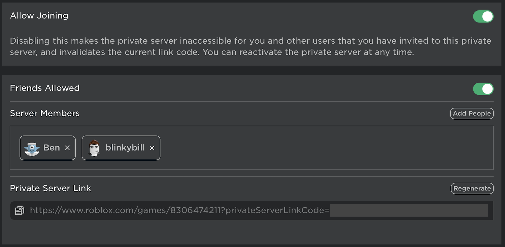

# Private Servers

Want to run your own metauni-style events? Our tools are [open source](https://metauni.org/posts/make-your-own/tools), so you can build your own [from scratch](https://metauni.org/posts/make-your-own/make-your-own). However, the easiest way to run events is to rent a [Private Server](https://en.help.roblox.com/hc/en-us/articles/205345050-How-do-I-Purchase-and-Configure-Private-VIP-Servers-). These are private copies of a server which you control; for example, you can control the list of people who can join, and you can advertise your event using your own URL. Private servers come with some subset of the following features ``out of the box'':

- Whiteboards
- Admin commands (kick, ban, fine-grained control over use of whiteboards)
- Voice chat (built into Roblox)
- Minigames / toys

It is the manifestation of the creative will of others which draws us out of our shells, and creates the possibility for the social interaction that makes experiences like metauni more than just Zoom calls in 3D. We believe that the best environments for scholarly life in the Metaverse will be collaborations between coders, musicians, visual artists, garden designers and domain experts (e.g. mathematicians).

## Available servers

The private servers currently available:

- [Circular Concept](https://www.roblox.com/games/8306474211/Circular-Concept#!/game-instances) with metaboard, Admin Commands. `Free`.
- [Iteration of Concept](https://www.roblox.com/games/8278496526/Iteration-of-Concept) with working boards, Admin commands, and Coin Run challenge in an environment built from a snapshot of Songspire ([making of](https://youtu.be/l_Fl6tKZvQQ)).

## Instructions

On the Roblox page for one of the private servers (e.g. [Iteration of Concept](https://www.roblox.com/games/8278496526/Iteration-of-Concept)) click on the `Servers` and `Create Private Server`. You can find your private server by either navigating to the Roblox page for the experience and returning to the `Server` tab, or under `Inventory > Private Servers` (see the left hand side of the Roblox homepage, under the hamburger menu). The Inventory is also where you can cancel your subscription to the private server (which auto-renews monthly).

You can configure your private server at the time of creation, or later by clicking the `...` button on the `Servers` tab of the experience. On the configuration page you will find `Allow Joining` which toggles the private server on and off, and the controls which set who can access the private server. In the image below, the private server is set to be accessible to all friends, to two specific users who are not friends, and to anyone who has the link code (regardless of whether or not they are friends of the owner of the private server). Note that **turning off the private server will invalidate old link codes**.

When you are ready to run your event, click `Join` under Private Servers (if you join the non-private version of the experience, you will still be able to enter the world but you will not be able to control it).

* **Admin commands**: when you join your private server type `/helpadmin` in the Chat to get instructions on using the Admin Commands. You can see further details [here](https://metauni.org/posts/make-your-own/tools).
* **Recording events**: you can activate the free camera with `Left Shift-P`, position the camera to view what you want to record, and then record your screen using software such as [Camtasia](https://www.techsmith.com/video-editor.html).
* **Crowd management**: if someone is behaving badly, you can kick them by typing `/kick username` in the Chat. Note that to find the true username of a player (as opposed to their displayed name) you may have to click on their name on the leaderboard (to the right hand side of the screen) and look for something like `@realusername`.

Running a private server comes with responsibilities, as spelled out in the terms of service of Roblox. You should therefore familiarise yourself with the [Roblox rules](https://metauni.org/posts/rules/rules) and [Discord Terms of Service](https://discord.com/terms) at the risk of getting your account locked or banned. If you observe users breaking Roblox rules, for example harrassing other users or engaing in offensive behaviour, you should **report them using the Roblox tools** that can be accessed via `Escape`.

For less serious matters use the Admin Commands. Please note that **some usages of the whiteboards** fall outside the Roblox rules (for example, the whiteboards should not be used as an alternative chat system, or used to post Discord links, URLs or offensive images, or in general to bypass the Roblox filtration system). We advise that you keep your private server turned off when not in use, and disable boards with `/boards off` when an administrator is not present.

## Future roadmap

We hope to implement the following features in private servers:

- Event management (such as the What's On boards in the metauni Hub)
- Automated video recording for talks (via bots running in the cloud)
- Assistance for uploading slides into Roblox
- Signing up for classes/tutorials and scheduling
