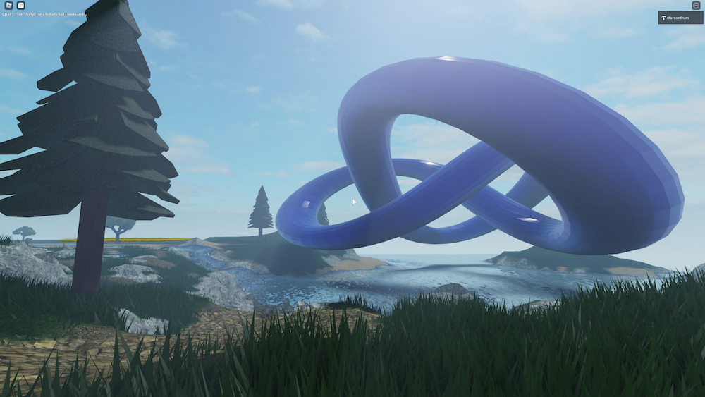
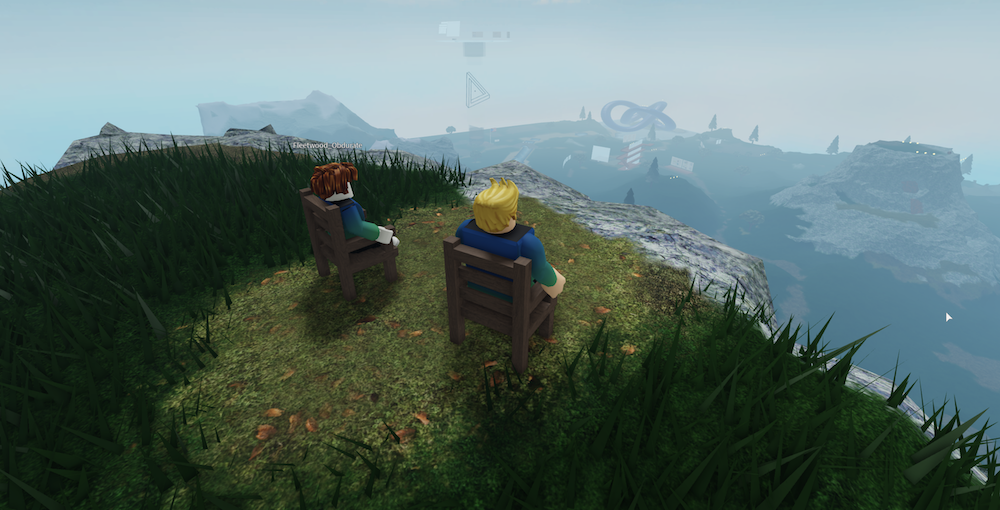
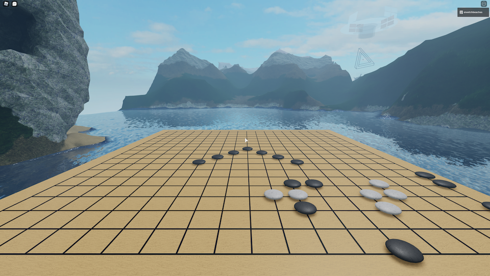

# The Rising Sea node

This node (TRS for short) is a collaboration between [Daniel Murfet](http://therisingsea.org/), Ziling Ye and [Lucas Cantor](https://www.lucascantormusic.com/). On this page you will find some eye candy and comments on our experience running events. This is also a place to cite some influences: Grothendieck (innocence, play and [all that](https://kongliang.wordpress.com/2010/02/27/hello-world/)), [Gwern](https://www.gwern.net/index), [Jonathan Blow](https://www.youtube.com/watch?v=qWFScmtiC44).

## Eye candy

The Knot (note how the shadows give a 2D projection, with darkness serving as a marker of over and under-crossings):

Office hours at the peak of the Island:

The Weiqi board at the Island. There is a [video](https://youtu.be/wWtrTFI4ppc) of this being constructed:

## Remarks

Here are some of DM's thoughts:

* The potential for beauty in virtual spaces, using a combination of visuals, interaction design, music and art, is much undervalued. In my view, a metauni node should aim to synthesise this kind of beauty with a sense of play and an unapologetic commitment to serious and difficult intellectual activity. That is the ideal we are trying to model with TRS.

* In Event 2 (the Build Your Own Node event, [video1](https://youtu.be/TDmMeR6O350), [video2](https://youtu.be/W0SIAygiITs)) we spent hours helping people get through these [instructions](http://metauni.org/posts/make-your-own/make-your-own). If this had been done on Zoom I'm quite certain the ambient mood would have been one of bitter frustration, but my sense was that people were having a good time even when they were stuck due to the spirit of play that pervades a well-designed virtual world (people would take breaks from following the instructions to try knock over signposts and kick them down into the Well of Past Events, for instance).

* metauni on an iPad is pretty great. You can run both Roblox and Discord on the device, and the former runs well since recent iPad hardware has very good performance in 3D games. Moreover if you have an Apple Pencil you can use it on the in-world whiteboards, and although it is a bit laggy it is definitely usable for short mathematical conversations.

* Discord is a functional replacement for Zoom with respect to sharing screens, but just like the free version of Zoom has certain limitations, so does the free tier of Discord. If you upgrade your server you can unlock higher resolution screen sharing (the free version is OK but you find it unusable depending on what you are doing) and higher audio quality. It's possible to mirror an iPad to a Mac and then screenshare, but it is probably better to just use in-world whiteboards which are already quite functional with an iPad, or a native app like [GoodNotes with collaborative sharing](https://medium.goodnotes.com/link-sharing-share-documents-adb36f99c583).

* Apparently there is no dedicated GUI for **kicking** players from your Roblox world. However this can be done from the server console: press `F9` (`fn+F9` on a  Mac) and on the `Log` tab select `Server`. Then at the command line type `game.Players.PlayerName:Kick("some message")` where `PlayerName` is the Roblox username you wish to kick.

* You can access a free floating camera with `Left Shift + P` if you want to check out what is going on in your world.

* If you're using `GetChildren` to build a slide deck, so you want the order of images in the Explorer to be the order they appear in, you might be [disappointed](https://developer.roblox.com/en-us/api-reference/function/Instance/GetChildren) because the order returned by `GetChildren` is the order the `Parent` property was set (roughly speaking, "who got added first"). A workaround is to make a Folder, drag all your objects there, and drag them back into the Parent object in the order you wish them to appear in `GetChildren`.

* If you're trying to use the TRS Weiqi board you should `Enable Studio Access to API Services` in Roblox Studio.

* Notes from Event 3 (Lucas's talk). The speaker was great. Another thing that helped the talk feel engaging were the parallel streams of communication involving both the speaker and the audience. There was the in-game chat, in which people were not only asking questions but also cracking jokes, as well as the Discord channel were some people were sharing memes. There is no doubt in my mind that this (whatever it is) feels closer to the _natural form_ of an online event than Zoom.
