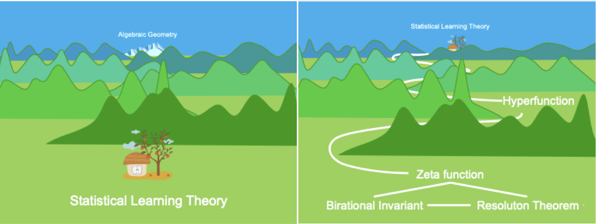

# Singular Learning Theory

This is a seminar on [Sumio Watanabe](http://watanabe-www.math.dis.titech.ac.jp/users/swatanab/)'s Singular Learning Theory (SLT), a theory applying algebraic geometry to statistical learning theory, co-organised by Edmund Lau and Dan Murfet.

*Image from Sumio Watanabe's [homepage](http://watanabe-www.math.dis.titech.ac.jp/users/swatanab/)*.

## References

The canonical references are Watanabe's two textbooks:

* **The gray book:** S. Watanabe "[Algebraic geometry and statistical learning theory](https://www.cambridge.org/core/books/algebraic-geometry-and-statistical-learning-theory/9C8FD1BDC817E2FC79117C7F41544A3A)" 2009.
* **The green book:** S. Watanabe "[Mathematical theory of Bayesian statistics](https://www.routledge.com/Mathematical-Theory-of-Bayesian-Statistics/Watanabe/p/book/9780367734817)" 2018.

Some other references:

* S. Wei, D. Murfet, M. Gong, H. Li , J. Gell-Redman, T. Quella "[Deep learning is singular, and that's good](https://www.suswei.com/publication/wei-2022-singular/wei-2022-singular.pdf)" 2022.
* E. Lau's blog [Probably Singular](https://edmundlth.github.io/posts/singular-learning-theory-part-1/).

## Schedule

Each week there is a main session and a supplementary session.

* **13-1-22** (*Dan Murfet*): What is learning? Singularities and pendulums ([video](https://youtu.be/QZG40ZY5TeU)).
    * **Supplementary** (*Edmund Lau*): The Fisher information matrix ([video](https://youtu.be/yniLt7ONj28)).
* **20-1-22** (*Edmund Lau*):  Fisher information, KL-divergence and singular models ([video](https://youtu.be/U9bnkWuFSSM)).
    * **Supplementary** (*Liam Carroll*): Markov Chain Monte Carlo ([video](https://youtu.be/Ns4w0vtWt4A)).
* **27-1-22** (*Liam Carroll*): Neural networks and the Bayesian posterior ([video](https://youtu.be/1Esk7G3g5X8))
    * **Supplementary** (*Spencer Wong*): Rings, ideals and the Hilbert basis theorem ([video](https://youtu.be/g1tXe9Yrij8)).
* **3-2-22** (*Spencer Wong*): From analytic to algebraic I ([video](https://youtu.be/5Gkzg-zTwv4)).
    * **Supplementary** (*Ken Chan*): Resolution of singularities ([video](https://youtu.be/ssU8VZ50Wd8)).
* **10-2-22** (*Dan Murfet*): Introduction to density of states ([video](https://youtu.be/HXCpQWZfWIw), [notes](http://www.therisingsea.org/notes/metauni/slt12.pdf)).
    * **Supplementary** (*Spencer Wong*): Polynomial division ([video](https://youtu.be/nNMCix6UCJ0)).
* **17-2-22** (*Spencer Wong*): From analytic to algebraic II ([video](https://youtu.be/tsZjeclrmuU)).
    * **Supplementary**: Working session 1 ([video](https://youtu.be/cuPeJkeiYsI)).
* **24-2-22** (*Edmund Lau*): Free energy asymptotics ([video](https://youtu.be/QBaJH5QRAA8))
    * **Supplementary**: Working session 2 ([video](https://youtu.be/c7Di-oAZxNg))
* **3-3-22** (*Spencer Wong*): From analytic to algebraic III ([video](https://youtu.be/LWylEE5M9lc)).
    * **Supplementary**: Working session 3 ([video](https://youtu.be/kqP5I2wALt0)).
* **10-3-22** (*Tom Waring*): Regularly parametrised models ([video](https://youtu.be/T8Lgvt0mfuY)).
* **17-3-22** (*Edmund Lau*): Bounding the partition function ([video](https://youtu.be/7x16e4yHsHg)).
* **24-3-22** (*Edmund Lau*): The influence of sampling ([video](https://youtu.be/JyZnMinS86Q)).
* **7-4-22** (*Edmund Lau*): Main Theorem 1 ([video](https://youtu.be/70UtL7pfxNo)).
* **14-4-22** (*Edmund Lau*): Main Theorem 2 ([video](https://youtu.be/qE3v1044BwU)).
* **8-9-22** (*Matt Faruggia-Roberts*): Complexity of rank estimation ([video](https://youtu.be/s2bgR_t3aGM)).
* **15-9-22** (*Matt Faruggia-Roberts*): Piecewise-linear paths in equivalent networks ([video](https://youtu.be/WBiFFIhGIZM)).
* **22-9-22** (*various*) A minimal introduction to the geometry of tanh networks ([video](https://youtu.be/EgqwUsJTumU)).
* **29-9-22** (*Dan Murfet*): Information theory I - entropy and KL divergence ([video](https://youtu.be/LDAtVVPazg4)).
* **6-10-22** (*Zhongtian Chen*): The Kraft-McMillan theorem ([video](https://youtu.be/N30wJhaO68k), [pocket](https://www.roblox.com/games/start?placeId=8165217582&launchData=pocket:Big%20Sir%202)).
* **13-10-22** (*Edmund Lau*): On Watanabe's paper: Asymptotic learning curve and renormalizable condition in statistical learning theory ([video](https://youtu.be/FhNoHmxmCmg), [pocket](https://www.roblox.com/games/start?placeId=8165217582&launchData=pocket:Big%20Sir%202)).
* **13-10-22** (*Dan Murfet*): Intro to blowing up (cross-posted from the [Abstraction seminar](https://metauni.org/abstraction/), [video](https://youtu.be/CWNaKMP8Teo), [pocket](https://www.roblox.com/games/start?placeId=8165217582&launchData=pocket:Big%20Sir%201)).
* **20-10-22** (*Dan Murfet*): State of scaling laws 2022 ([video](https://youtu.be/7LzW8-wxdUE), [pocket](https://www.roblox.com/games/start?placeId=8165217582&launchData=pocket:Symbolic%20Wilds%2010)).
* **27-10-22** (*Dan Murfet*): In-context learning ([video](https://youtu.be/Vqmcn1q7VL0), [pocket](https://www.roblox.com/games/start?placeId=8165217582&launchData=pocket:Symbolic%20Wilds%2011)).

## Background reading

Some rough handwritten notes:

* [Deep Learning Theory 1](http://www.therisingsea.org/notes/metauni/dlt1.pdf): Why deep learning theory?
* [Deep Learning Theory 2](http://www.therisingsea.org/notes/metauni/dlt2.pdf): Thermodynamics of Singular Learning Theory
* [Deep Learning Theory 3](http://www.therisingsea.org/notes/metauni/dlt3.pdf): Phase transitions
* [Singular Learning Theory 4](http://www.therisingsea.org/notes/metauni/slt4.pdf): Local RLCT
* [Singular Learning Theory 5](http://www.therisingsea.org/notes/metauni/slt5.pdf): Symmetry and RLCT
* [Singular Learning Theory 6](http://www.therisingsea.org/notes/metauni/slt6.pdf): Generalisation and Power Laws
* [Singular Learning Theory 8](http://www.therisingsea.org/notes/metauni/slt8.pdf): Calculations for feedforward networks
* [Singular Learning Theory 12](http://www.therisingsea.org/notes/metauni/slt12.pdf): Density of states
* [Singular Learning Theory 13](http://www.therisingsea.org/notes/metauni/slt13.pdf): Asymptotics of the free energy
